Everyone uses AI.

每个人都在使用人工智能。

Almost nobody understands how it actually works.

几乎没有人真正了解它的运作机制。

People throw around words like transformers, embeddings, RAG, agents, RLHF…

人们经常使用诸如“变压器”、“嵌入层”、“RAG 模型”、“智能体”、“强化学习框架”之类的术语……

…as if everyone already knows.

……好像每个人都已经知道了似的。

Most don't.

大多数人并不这么做。

And honestly?

说实话？

AI is not that complicated once you see the mental models.

一旦理解了相关的思维模型，人工智能其实并不那么复杂。

ChatGPT. Claude. Midjourney. Cursor. Coding agents.

ChatGPT、Claude、Midjourney、Cursor、编程智能体。

They all make sense once you understand the 20 ideas below.

一旦理解了下面的 20 个概念，所有这些内容就都变得合乎逻辑了。

No PhD required. No jargon. Just simple explanations and visuals.

不需要博士学位。不需要专业术语，只需简单的解释和图表说明即可。

Save this. You will use it again.

保存这个。你以后还会再次使用它。

#### PART 1: HOW AI ACTUALLY WORKS (The foundation everything is built on)

#### 第一部分：人工智能究竟是如何工作的（所有技术的基础）

1. Neural Networks
1. 神经网络

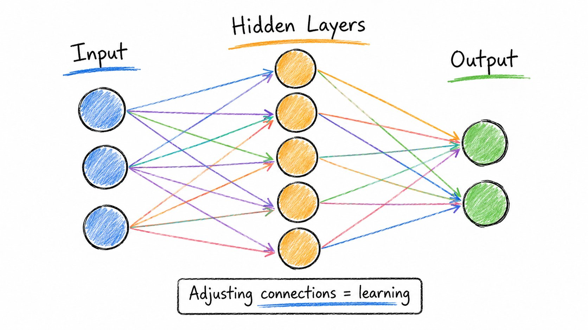

The brain of every AI model.

每个人工智能模型的“大脑”。

A neural network is a pipeline of layers.
神经网络是由多个层构成的架构。

→ Data enters the input layer → Passes through hidden layers → Exits as a prediction

数据进入输入层 → 经过隐藏层 → 最终以预测结果的形式输出

Each connection has a "weight" — a tiny score that controls how much influence one neuron has on the next.

每个连接都有一个“权重”——一个微小的数值，它决定了一个神经元对下一个神经元的影响程度。

Training = adjusting billions of these weights until the output is accurate.

训练过程就是不断调整这些数十亿个权重，直到输出结果准确无误。

Simple idea. Insane at scale.

这个想法很简单。但一旦大规模实施，就会变得非常出色。

GPT-4 has ~1.8 trillion parameters. Claude 3 Opus has hundreds of billions.

GPT-4 拥有约 1.8 万亿个参数。而 Claude 3 Opus 则拥有数千亿个参数。

All from the same basic concept: layered neurons with adjustable connections.

所有这些都基于同一个基本概念：具有可调节连接的多层神经元。

2. Tokenization

2. 令牌化

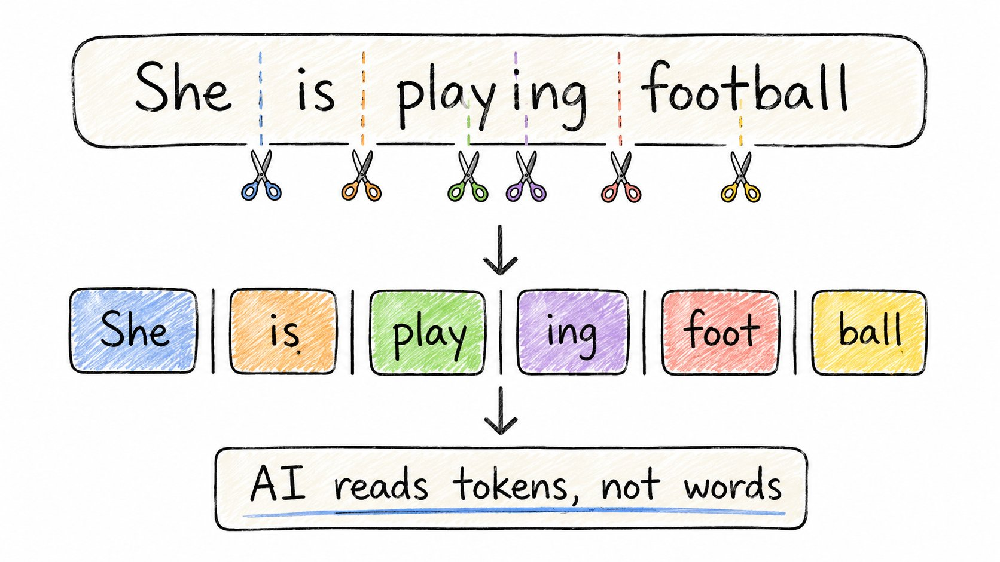

Before AI reads your text, it breaks it into pieces called tokens.

在人工智能读取你的文本之前，它会将文本拆分成若干片段，这些片段被称为“标记”。

Not always full words.

不总是使用完整的单词。

"playing" → "play" + "ing" "ChatGPT" → "Chat" + "G" + "PT" "dog" → "dog" (stays whole)

“playing” → “play” + “ing” “ChatGPT” → “Chat” + “G” + “PT” “dog” → “dog”（保持完整）

Why not just use full words?

为什么不使用完整的单词呢？

Language is messy. New words. Typos. Mixed languages. A fixed vocabulary of words would be impossibly large.

语言是复杂的。总是有新的词汇出现，也会出现拼写错误。各种语言相互交织在一起。固定词汇的库实在是难以想象地庞大。

Tokens are reusable building blocks.

代币是可重复使用的构建模块。

Even if the model has never seen a word, it can understand it by breaking it into familiar pieces.

即使这个模型从未见过某个单词，它仍然可以通过将其拆分成熟悉的组成部分来理解该单词的含义。

Rough rule: 1 token ≈ 0.75 words.

大致规则：1 个标记约等于 0.75 个单词。

1000 tokens ≈ 750 words.

1000 个标记约等于 750 个字。

3. Embeddings

3. 嵌入式处理

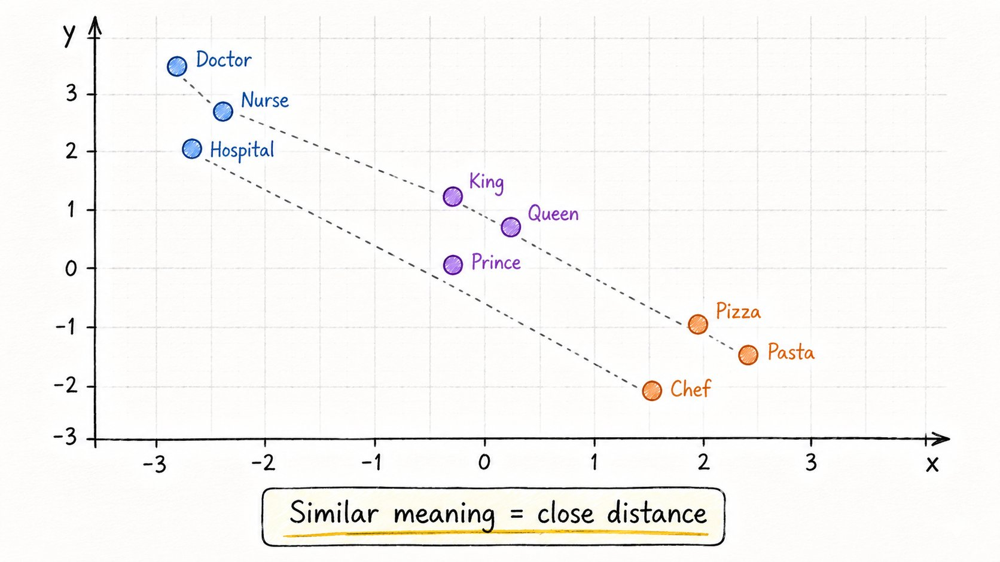

Once text is tokenized, each token becomes a number.

当文本被切分成一个个单词或短语后，每个单词或短语都会对应一个数字。

That number is an embedding — a vector that represents meaning.

那个数字其实是一种“嵌入”——一个能够代表意义的向量。

Think of it as Google Maps for words.

可以将其视为单词版的谷歌地图。

→ "Doctor" and "Nurse" sit close together → "Doctor" and "Pizza" sit far apart → "King" minus "Man" plus "Woman" ≈ "Queen"

→ “医生”和“护士”坐得很近→ “医生”和“披萨”则坐得相距较远→ “国王”减去“男人”，再加上“女人”≈“女王”

The model doesn't understand words like you do.

这个模型无法理解像你这样的词语。

It understands distance and direction.

它能够理解距离和方向。

This is what powers: → Semantic search → Recommendations → RAG systems

这就是所谓的“力量”：→ 语义搜索 → 推荐系统 → 问答系统

Everything that "understands intent" uses embeddings under the hood.

所有那些“能够理解意图”的系统，实际上都在内部使用了嵌入技术。

4. Attention

4. 请注意

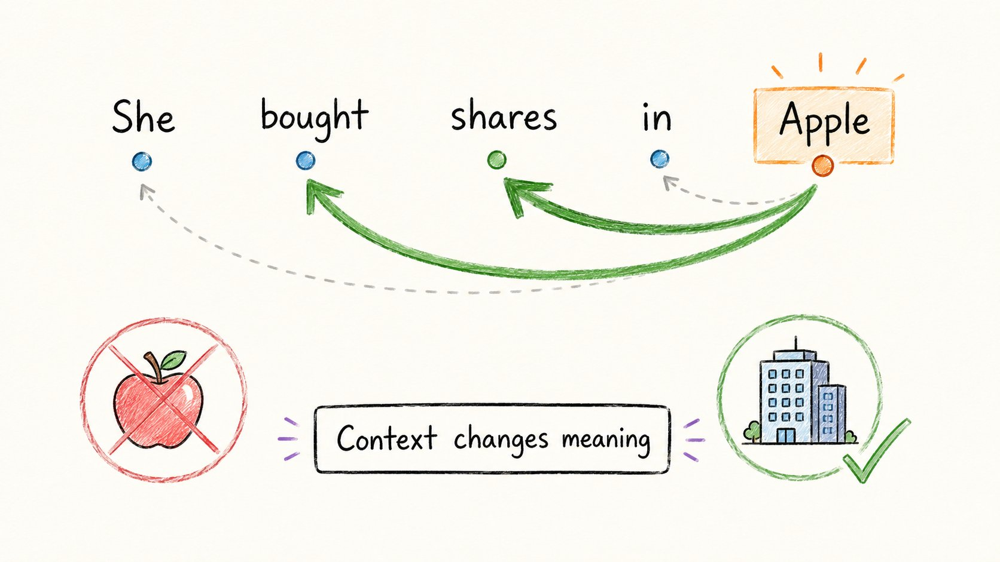

The word "Apple" means different things:

“Apple”这个词有不同的含义：

→ "I ate an Apple" → fruit → "I bought Apple stock" → company

→ “我吃了个苹果” → 水果 → “我购买了苹果公司的股票” → 公司

Embeddings alone can't solve this.

仅靠嵌入技术是无法解决这个问题的。

Attention can.

注意力可以被控制。

Attention lets every word look at every other word in a sentence and decide what matters.

注意力让每个单词都去观察句子中的其他单词，并决定哪些单词是重要的。

In "She bought shares in Apple": → "Apple" pays high attention to "shares" and "bought" → Model concludes: company, not fruit

在《她购买了苹果公司的股票》这一情节中：→“苹果公司”对“股票”和“购买”这两个概念非常重视→作者得出结论：这所指的是公司，而非水果

Before attention, models read left-to-right. Slow. Limited.

在引起注意之前，模型会从左到右进行读取。速度较慢，能力有限。

After attention, models see the whole sentence at once.

在引起注意之后，模型会一次性看到整句话的内容。

This single idea unlocked modern AI.

这个独特的想法开启了现代人工智能的发展。

5. Transformers

5. 变形金刚

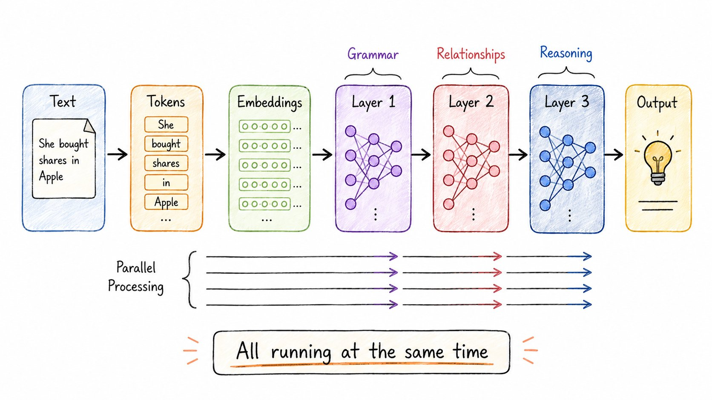

The architecture powering almost every AI model today.

如今，几乎每一种人工智能模型所依赖的架构技术。

Introduced in 2017 in a paper called "Attention Is All You Need."

该模型于 2017 年在一篇名为《只需要注意力》的论文中被提出。

The breakthrough: instead of reading text one word at a time, process everything in parallel using 
attention.

这一突破在于：我们不再逐个单词地阅读文本，而是利用注意力将所有信息并行处理。

How it works: → Text → Tokens → Embeddings → Stacked attention layers → Output

工作原理如下：→ 文本 → 令牌 → 嵌入向量 → 堆叠的注意力层 → 输出结果

Each layer refines understanding: → Early layers: grammar, basic structure → Middle layers: word relationships → Deep layers: complex reasoning

每一层都有助于加深理解：→ 早期层次：语法、基本结构 → 中间层次：词语关系 → 深层层次：复杂推理

The result: massively faster training and far better outputs.

结果就是：训练速度大大加快，输出效果也显著提高。

GPT. Claude. Gemini. Llama. Mistral.

GPT、Claude、Gemini、Llama、Mistral。

All transformers.

所有的变压器。

If you understand this one architecture, you understand modern AI.
如果你理解了这种架构，那么你就掌握了现代人工智能的原理。

PART 2: HOW LLMs WORK (What's actually happening when you chat with AI)
第二部分：大语言模型是如何工作的（当你与人工智能对话时，实际上发生了什么）

6. LLMs (Large Language Models)
6. 大型语言模型（LLM）

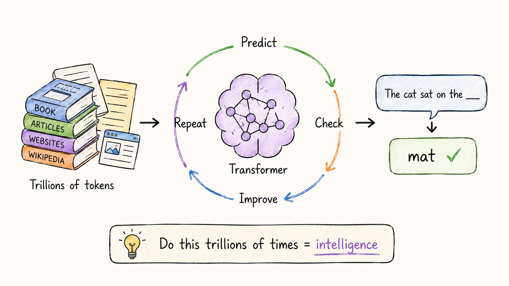

An LLM is a transformer trained on a massive amount of text.

LLM 是一种在大量文本数据上训练的变换器模型。

Books. Websites. Code. Wikipedia. Reddit.
书籍、网站、代码、维基百科、Reddit。

Trillions of tokens.

数万亿个代币。

The training task sounds too simple to be powerful:

这个训练任务听起来太过简单了，根本不值得重视：

→ Predict the next token.

→ 预测下一个关键字。

That's it.

就是这么回事。

But when you repeat this across trillions of examples, something remarkable happens.

但是，当这一规律被在数万亿个例子中反复验证时，就会发生一些令人惊讶的事情。

The model learns grammar. Then reasoning. Then how to write code, translate languages, solve math problems.

这个模型首先学习语法规则。然后进行推理。接着学习如何编写代码、翻译语言文本、解决数学问题。

No one told it to do any of that.

没有人指示它做任何那些事情。

It emerged from next-token prediction at scale.

它是从大规模的下一个令牌预测中衍生出来的。

"Large" = hundreds of billions of parameters. Training cost = millions of dollars.

“大型”系统意味着拥有数百亿个参数。训练成本则高达数百万美元。

ChatGPT, Claude, Gemini → all LLMs.

ChatGPT、Claude、Gemini——这些都是大语言模型。

7. Context Window

7. 上下文窗口

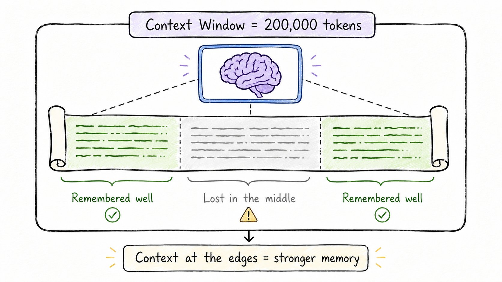

Every AI model has a memory limit.

每个人工智能模型都有内存限制。

It's called the context window.

这个窗口被称为上下文窗口。

It's the maximum number of tokens the model can "see" at once — your message + its response + conversation history.

这是模型同时能够“看到”的代币数量的最大值——包括你的消息、模型的回复以及双方的对话历史记录。

Early GPT: ~4,000 tokens. GPT-4: 128,000 tokens. Claude 3.5: 200,000 tokens. Gemini 1.5 Pro: 1,000,000 tokens.

早期的 GPT 模型：约 4,000 个标记。GPT-4：128,000 个标记。Claude 3.5：200,000 个标记。Gemini 1.5 Pro：1,000,000 个标记。

Bigger window = more context = better answers.

更大的窗口面积意味着更多的信息，从而能得到更好的答案。

But there's a catch.

不过，有个条件。

Models don't read everything equally.

这些模型并不是对所有内容都同样敏感。

They focus on the beginning and end of the context.

他们专注于上下文的起始和结束部分。

The middle? Often ignored.

中间的部分？往往被忽视。

This is called the "Lost in the Middle" problem.

这个问题被称为“处于中间状态的问题”。

Big context window ≠ perfect memory.

大的上下文窗口并不意味着完美的记忆能力。

Understanding this explains why AI sometimes "forgets" something you clearly mentioned.

理解这一点就能解释为什么人工智能有时会“忘记”你明确提到的一些内容。

8. Temperature

8. 温度

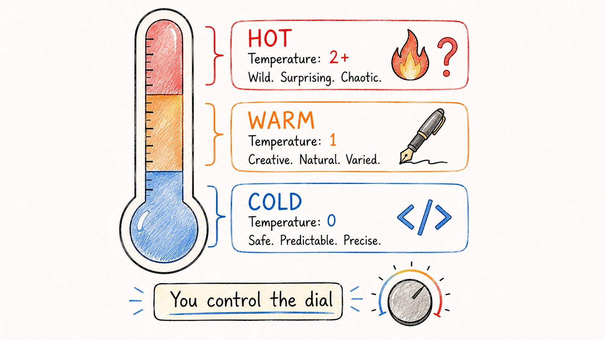

When AI generates text, it doesn't just pick the most likely next word every time.

当人工智能生成文本时，它并不会每次都只选择最有可能出现的下一个单词。

It has a dial called temperature.

它有一个名为“温度”的刻度盘。

→ Temperature = 0: always picks the safest, most predictable word → Temperature = 1: picks more 

creatively, more variety → Temperature = 2+: gets wild, sometimes incoherent

→ 温度=0 时：总是选择最安全、最可预测的词。  

→ 温度=1 时：选择的方式更富有创意，词汇的多样性也更高。  

→ 温度=2+时：选择方式变得更为随机，有时甚至难以理解。

Low temperature → use for: code, facts, summaries High temperature → use for: brainstorming, creative writing, variations

低温环境下适用：编码、整理信息、总结。  

高温环境下适用：头脑风暴、创意写作、设计变体。

Most tools set this for you automatically.

大多数工具都会自动为你完成这一设置。

But understanding it explains why sometimes AI seems "boring" and sometimes it surprises you.

但是，理解这一点可以解释为什么有时候人工智能看起来很“无趣”，而有时候又会给你带来惊喜。

9. Hallucination

9. 幻觉

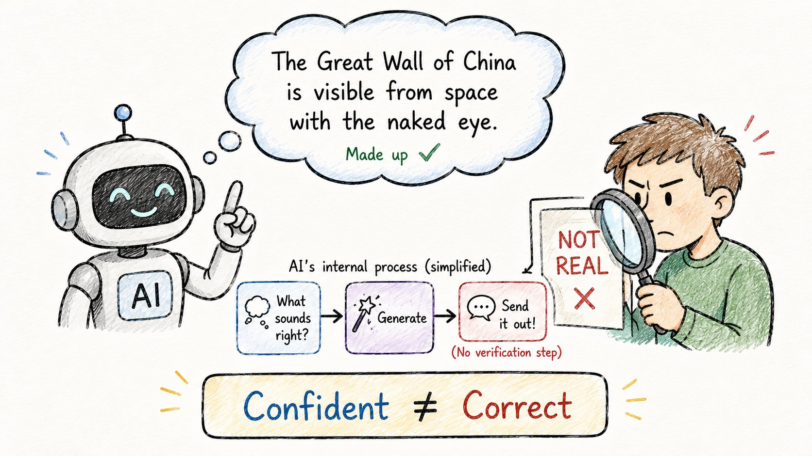

AI lies with confidence.

人工智能充满自信地行事。

Not on purpose. It literally cannot help it.

不是故意的。实际上，我根本无法控制这种情况。

Here's why.

这就是原因。

An LLM doesn't search for truth.

大语言模型并不追求真理。

It predicts what the most probable next token is.

它预测了下一个最可能出现的符号是什么。

If a false statement looks like something that "should come next" based on training patterns, it generates it.

如果一条虚假陈述看起来符合基于训练模式所预期出现的样子，那么系统就会生成它。

No verification. No lookup. Pure pattern matching.

无需验证，无需查询，只是简单的模式匹配。

So it will: → Cite a research paper that doesn't exist → Invent an API function that was never created → State a fake historical "fact" with complete confidence

所以就会这样：→引用一篇根本不存在的研究论文；→编造一个从未被创造过的 API 功能；→自信地陈述一个虚假的历史“事实”。

This is called hallucination.

这被称为幻觉。

The fix: never trust AI output on facts without verifying.

解决方案：在验证之前，切勿轻信人工智能生成的事实信息。

Use RAG (concept 16) to ground it in real data.

使用 RAG 机制（概念 16），将其建立在真实数据之上。

10. Prompt Engineering

10. 诱导性问题设计

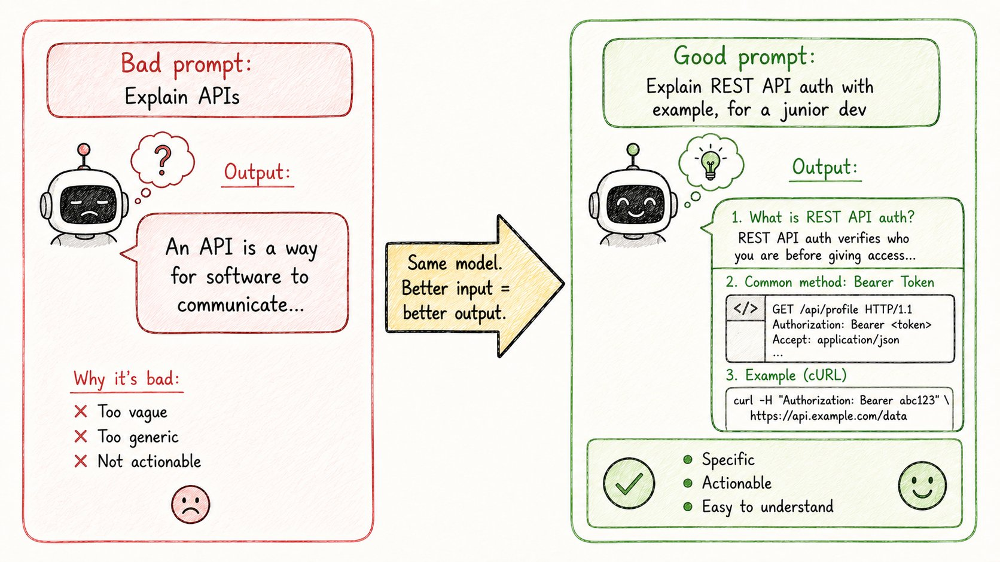

The way you ask changes everything.

你提问的方式决定了一切。

Same model. Same question. Wildly different results based on how you frame it.

同样的模型，同样的问题。但结果却大相径庭，这取决于你如何来理解和处理这个问题。

Bad prompt: → "Explain APIs" → Gets: vague, surface-level answer

糟糕的提示问题：→ “解释 API” → 得到的答案是模糊的、只停留在表面层次的解释。

Good prompt: → "Explain how REST APIs handle authentication. Give a real example with code. Assume I'm a junior developer." → Gets: specific, structured, immediately useful

好的提示：→ “请解释 REST API 如何处理身份验证问题。请给出一个包含代码的实际示例。假设我是一名初级开发者。”→ 结果：具体、有
条理，且立即有用。

Prompt engineering is just clear communication.

提示工程其实就是清晰的沟通方式。

The tricks that actually work: → Give context ("I'm building a SaaS for X") → Assign a role ("Act as a senior backend engineer") → Show examples ("Here's a format I like: ___") → Be specific about output ("Give me 5 options as a numbered list") → Break complex asks into steps

真正有效的技巧包括：提供上下文（“我正在为 X 项目开发 SaaS 服务”）;分配角色（“担任高级后端工程师”）;举例说明（“这里有个我喜
欢的格式：___”）;明确说明输出结果（“请列出 5 个选项，并用编号列表表示”）;将复杂的任务分解为简单的步骤。

Prompt engineering isn't a hack.
提示工程并非一种作弊手段。

It's the main way you communicate with the model.
这是你与模型进行通信的主要方式。

PART 3: HOW AI MODELS IMPROVE (How raw models become useful products)
第三部分：人工智能模型如何提升性能（如何让原始模型变成实用的产品）

11. Transfer Learning

11. 迁移学习

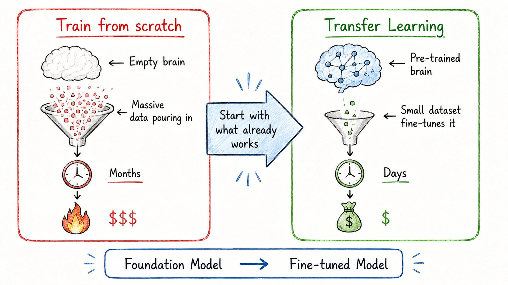

Training from scratch is expensive.

从零开始进行培训是非常昂贵的。

Insane amounts of data. Massive compute. Weeks of training.

大量的数据。强大的计算能力。数周的训练时间。

Transfer learning solves this.

迁移学习解决了这个问题。

You take a model already trained on a huge general task and adapt it for something specific.

你可以使用已经针对大规模通用任务训练好的模型，然后将其适配到特定的应用场景中。

You're not starting from zero. You're building on top.

你并不是从零开始。你是在已有的基础上进行建设的。

Think of it like this:

可以这样思考：

→ You already know how to ride a bike → Learning a motorcycle is much faster because of that → You transfer what you already know

→ 你已经会骑自行车了→因此学习骑摩托车就会快得多→你可以运用你已经掌握的知识来学习新技能。

This is how almost all AI products work today:

如今，几乎所有的 AI 产品都是按照这种方式运行的：

→ OpenAI trains massive foundation model → Companies fine-tune it for their specific use case → Saves millions in compute and months of training

OpenAI 正在训练庞大的基础模型。各公司会根据自己的具体需求对该模型进行微调。这样一来，就能节省数百万的计算资源，并减少数月的训练时间。

No company trains from scratch anymore.

现在没有公司还会从零开始进行培训了。

12. Fine-Tuning

12. 微调

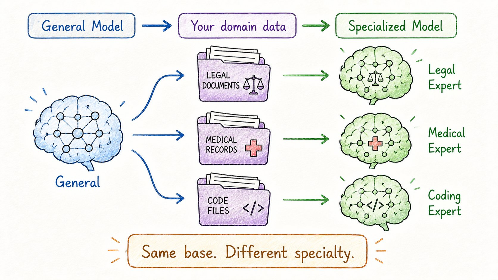

Transfer learning tells you the concept.

迁移学习解释了这个概念。

Fine-tuning is how you do it.

精细调校正是实现这一目标的方式。

You take a pretrained model and continue training it on a smaller, focused dataset.

你使用一个已经预训练的模型，然后在较小的、更集中的数据集上进行进一步的训练。

The model already speaks "language."

这个模型已经能够“说话”了。

Now you're teaching it your specific domain.

现在，你正在教授这个特定领域的知识。

Examples: → Medical model fine-tuned on clinical notes → Legal model fine-tuned on contracts → Coding model fine-tuned on GitHub

例如：→ 基于临床笔记训练的医学模型 → 基于合同训练的法律模型 → 基于 GitHub 代码训练的编码模型

The result: a model that responds perfectly for your use case.

最终得到的模型能够完美满足你的需求。

The cost: you need to update billions of parameters.

成本方面：你需要更新数十亿个参数。

That requires serious compute — multiple GPUs, serious infrastructure.

这需要强大的计算能力——多个 GPU，以及完善的基础设施支持。

(This is why LoRA, the next concept, matters so much.)

（这就是为什么下一个概念——LoRA 如此重要的原因。）

13. RLHF (Reinforcement Learning from Human Feedback)

13. 人类反馈强化学习（RLHF）

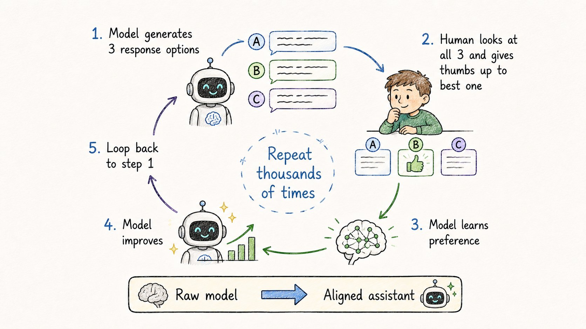

Fine-tuning makes models specialized.

微调使得模型具有特定功能。

RLHF is what makes them feel helpful and safe.

RLHF 正是让他们感到有帮助和安全感的原因。

Without it: the model just predicts text. Fluent, but not aligned.

没有它的情况下：这个模型只是能够预测文本的内容。虽然效果不错，但文本之间并没有对齐。

With it: the model learns what humans actually prefer.

通过这种方法，该模型能够了解人类的实际偏好。

Here's how it works:

以下是其运作方式：

→ Show model a prompt → Model generates multiple responses → Humans rank the responses → Model learns to prefer what humans prefer

→ 向模型展示提示内容 → 模型生成多种回应 → 人类对回应进行评分 → 模型逐渐学会偏好人类喜欢的回应

Repeat thousands of times.

重复数千次。

The model builds a sense of "good answer": → Clear → Helpful → Honest → Safe

这个模型能够营造出一种“好答案”的感觉：清晰、有帮助、诚实、安全。

This is why ChatGPT and Claude feel like assistants — not random text generators.

这就是为什么 ChatGPT 和 Claude 看起来像是真正的助手，而不是简单的文本生成器而已。

Without RLHF, they'd still be impressive. But far less useful, less trustworthy, and much harder to control.

如果没有人工干预，他们的表现依然会非常出色。不过，这样的表现会少一些实用性，可靠性也会低一些，而且更难被控制。

14. LoRA (Low-Rank Adaptation)

14. LoRA（低秩自适应算法）

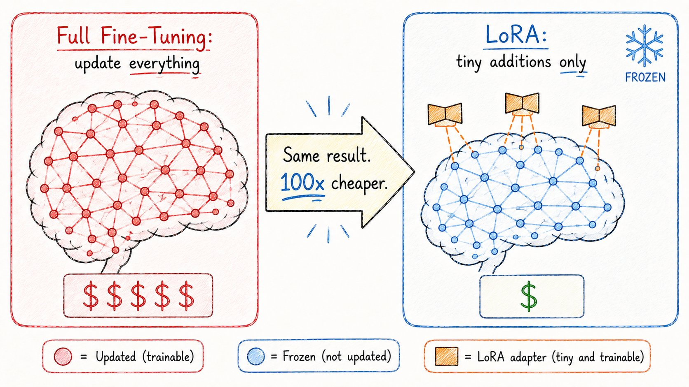

Fine-tuning is powerful but expensive.

微调操作非常有效，但成本较高。

Updating billions of parameters needs multiple GPUs and serious infrastructure.

更新数十亿个参数需要多个 GPU 以及强大的基础设施支持。

LoRA solves this.

LoRA 解决了这个问题。

Instead of changing the whole model, LoRA:

与其彻底改变整个模型，不如使用 LoRA 方法。

→ Keeps the original model frozen → Adds tiny trainable layers on top → These layers are a fraction of the full model size

→ 保留原始模型不变 → 在顶部添加了一些小型的可训练层 → 这些层的规模只是完整模型的很小一部分

The insight: most fine-tuning changes are small.

洞察是：大多数微调变更都是微不足道的。

You don't need to rewrite the whole model.

你不需要重新编写整个模型。

You just need small targeted adjustments.

你只需要进行一些小的、有针对性的调整即可。

Results: → Fine-tuning on a single consumer GPU: possible → Store one base model + swap different LoRA adapters: practical → Multiple specialized models without massive storage: done

结果：→ 可以在单台消费者级 GPU 上进行微调；→ 可以存储一个基础模型，同时使用不同的 LoRA 适配器；→ 无需大量存储空间即可实现多个专业模型的应用；→ 已经实现。

LoRA is why open-source AI exploded.

正是 LoRA 使得开源 AI 领域得到了飞速发展。

Suddenly anyone could fine-tune powerful models on a laptop.

现在，任何人都可以在笔记本电脑上轻松训练出强大的模型了。

15. Quantization

15. 量化

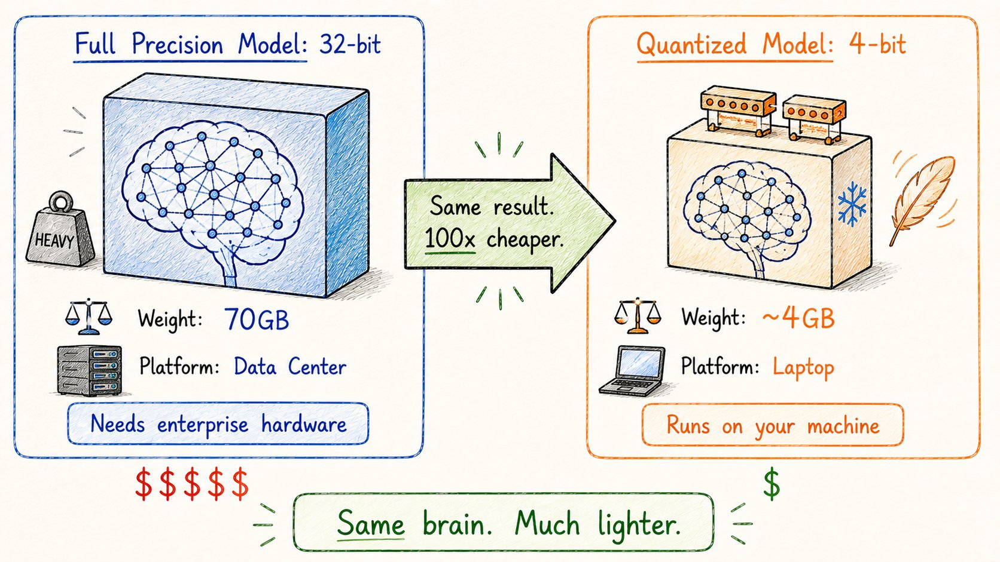

Models are getting huge.

模型的数量正在不断增加。

Running them requires serious memory and compute.

运行这些程序需要大量的内存和计算资源。

Quantization makes them smaller and cheaper to run.

量化处理使得它们变得更小型化，同时也降低了运行成本。

How: reduce the precision of each weight.

方法：降低每个权重的精度。

A weight stored in full precision uses 32 bits.

一个以全精度存储的权重值需要 32 位的空间来保存。

Quantized to 4-bit → 8x smaller.

量化到 4 位后，数值缩小了 8 倍。

Crazy thing: the quality drop is often surprisingly small.

奇怪的是：质量下降的幅度往往出人意料地小。

This is why you can now: → Run LLaMA on a MacBook → Run Mistral locally on a consumer GPU → Use powerful models on a phone

因此，现在你可以这样做：→在 MacBook 上运行 LLLaMA 模型；→在消费者级 GPU 上本地运行 Mistral 模型；→在手机上使用强大的模型。

Without quantization, large models would stay locked in data centers.

如果没有量化处理，那么大型模型将一直停留在数据中心中无法使用。

With quantization, they run on your machine.

通过量化处理，这些程序可以在你的计算机上运行。

PART 4: HOW REAL AI SYSTEMS ARE BUILT (What's behind the products you actually use)

第四部分：真实人工智能系统的构建方式（你实际使用的产品背后的真相）

16. RAG (Retrieval-Augmented Generation)

16. 检索增强生成（Retrieval-Augmented Generation）

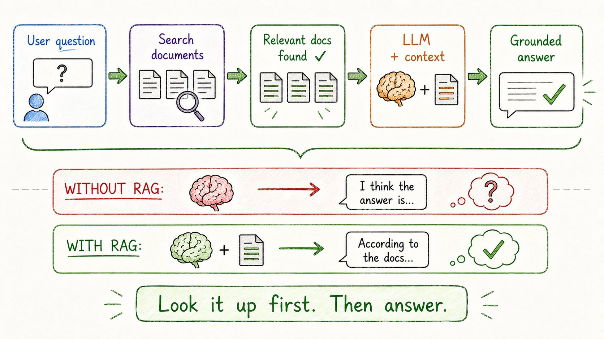

LLMs hallucinate because they answer from memory.

大型语言模型会产生幻觉，因为它们是根据记忆来回答问题的。

RAG fixes this by letting them look things up first.

RAG 通过让他们先查询相关信息来解决这个问题。

How it works:

其工作原理如下：

User asks a question

用户提出了问题

System searches a knowledge base for relevant documents

系统会在知识库中搜索相关的文档。

Those documents are passed to the model as context

这些文档被作为上下文传递给模型。

Model answers using real information — not guesses

使用真实信息来编写答案——而不是猜测。

Think of it like:

可以这样理解：
→ Closed-book exam (no RAG): answers from memory, often wrong → Open-book exam (RAG): checks the source, far more accurate

→闭卷考试（无参考材料）：只能凭记忆答题，答案往往不准确。  

→开卷考试（有参考材料）：可以查阅相关资料，答案的准确性要高得多。

Why it's powerful: → No retraining when your data changes — just update the documents → Model always works with current, accurate information → Reduces hallucination dramatically

为何如此强大：→ 当数据发生变化时，无需重新进行培训——只需更新文档即可 → 模型始终基于最新、准确的信息进行运算 → 大幅减少了幻觉现象

Every serious AI product uses RAG.

每一个成熟的 AI 产品都会使用 RAG 技术。

Customer support bots. Legal tools. Medical assistants. Internal knowledge bases.

客户支持机器人。法律工具。医疗助手。内部知识库。

17. Vector Databases

17. 矢量数据库

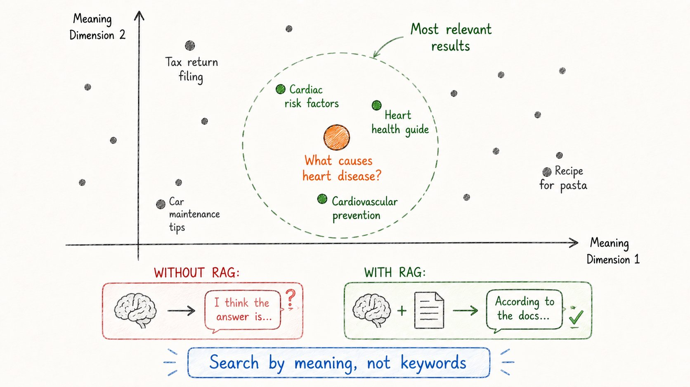

RAG needs to find the right documents fast.

RAG 需要尽快找到正确的文件。

But how do you search millions of documents by meaning — not just keywords?

但是，如何根据文档的含义来搜索数百万份文档呢？而不是仅仅通过关键词来进行搜索而已。

Vector databases.

向量数据库。

Here's how they work:

它们的运作方式如下：

Every document gets converted into an embedding (a vector of numbers)

每个文档都会被转换为一种嵌入格式（即一组数字向量）。

These vectors get stored in the database

这些向量被存储在了数据库中。

When a user asks a question, the question also becomes a vector

当用户提出一个问题时，这个问题本身也变成了一个向量。

Database finds vectors closest to the question vector

数据库找到了与问题向量最接近的几个向量。

Returns most semantically similar documents

返回在语义上最相似的文档

Why this is better than keyword search:

为什么这种方式比关键词搜索更优：

→ "heart disease treatment" finds documents about "cardiac care protocols" → Even though the exact words don't match, the meaning does

→ “心脏病治疗”相关的文档中提到了“心脏护理方案”的内容 → 虽然文字表述不完全一致，但意思却是一样的

Tools: Pinecone, Qdrant, Weaviate, pgvector

工具：Pinecone、Qdrant、Weaviate、pgvector

Vector databases are what makes AI systems "understand" — not just match strings.

向量数据库使得人工智能系统能够“理解”数据——而不仅仅是匹配字符串。

18. AI Agents

18. 人工智能代理

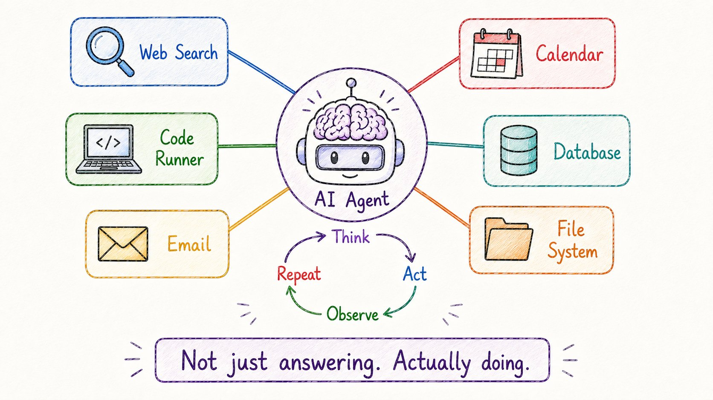

An LLM responds to messages.

大语言模型能够回复消息。

An AI agent actually does things.

一个人工智能代理确实能够执行任务。

The difference:

差异：
→ LLM: you ask, it answers, done → Agent: you give a goal, it plans, takes actions, checks results, adjusts, repeats

→大语言模型：你提问，它回答，完成任务→智能代理：你设定目标，它进行规划、采取行动、检查结果，并根据需要进行调整，重复整个过程。

The agent loop:

代理循环：

Think → Act → Observe → Repeat

思考 → 行动 → 观察 → 重复

Example: coding agent fixing a bug → Reads the issue → Explores the codebase → Identifies the problem → Writes a fix → Runs tests → Sees what failed → Adjusts the fix → Repeats until done

示例：编码代理修复漏洞的过程如下：首先阅读相关问题描述；然后检查代码库；接着找出问题所在；随后编写修复代码；执行测试以确认修复是否有效；如果测试失败，则调整修复方案；重复上述步骤直至问题解决。

The model is the brain. Tools are the hands.
这个模型就像大脑；工具则像手。

What tools can agents use? → Web search → Code execution → File system → APIs → Email / calendar → Databases

代理人可以使用哪些工具呢？→ 网络搜索 → 代码执行 → 文件系统 → 应用程序接口 → 电子邮件/日历功能 → 数据库

Agents are what turn AI from a chatbot into a coworker.

这些代理正是将人工智能从聊天机器人转化为实际工作伙伴的工具。

19. Chain of Thought (CoT)

19. 思维链（CoT）

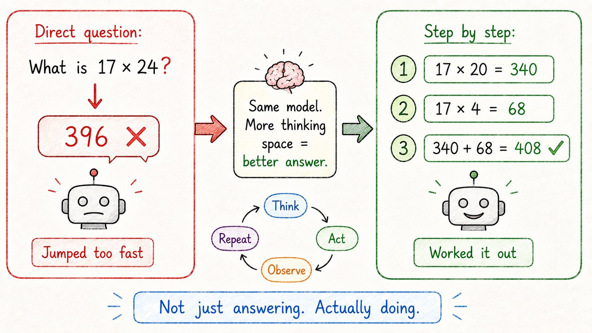

Sometimes AI gets the wrong answer not because it's stupid.

有时候，人工智能给出的答案是错误的，但这并非因为它愚蠢。

But because it jumped to the answer too fast.

不过，因为它太快就给出了答案，所以才出现了这个问题。

Chain of thought fixes this.

思维链可以解决这个问题。

Instead of asking for the final answer directly:

而不是直接询问最终答案：

→ "Solve: If a train travels 60mph for 2.5 hours, how far?"

“解答：如果一列火车以 60 英里每小时的速度行驶 2.5 小时，那么它能行驶多远？”

You prompt it to think step by step:

你引导它一步步地思考：

→ "Solve step by step: Speed = 60mph. Time = 2.5 hours. Distance = Speed × Time = ?"

“逐步求解：速度等于 60 英里每小时。时间等于 2.5 小时。距离等于速度乘以时间，即？”

The model walks through reasoning: → Step 1: Identify the formula → Step 2: Plug in numbers → Step 3: Calculate

这个模型的过程如下：→ 步骤 1：确定相关公式 → 步骤 2：输入数值 → 步骤 3：进行计算

Far more reliable for math, logic, multi-step problems.

在数学、逻辑运算以及多步骤的问题解决方面，这种方式要可靠得多。

The insight: give the model room to think, not just react.

核心思想是：给模型以思考的空间，而不仅仅是让它们做出反应。

This is why prompts like "think step by step" or "reason through this carefully" actually work.

这就是为什么像“一步步思考”或“仔细分析这个问题”这样的提示真的有效。

20. Diffusion Models

20. 扩散模型

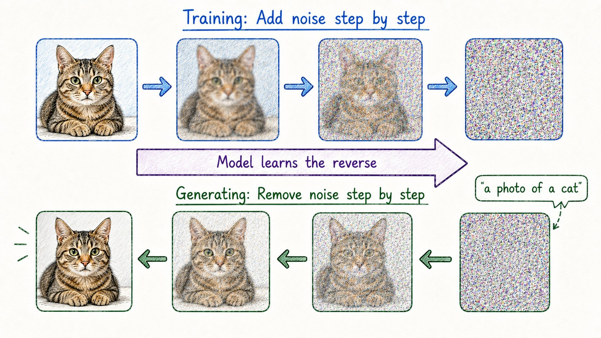

Everything so far has been about text.

到目前为止，所有的内容都集中在文本上。

Diffusion models explain how AI generates images.

扩散模型解释了人工智能是如何生成图像的。

The process is counterintuitive.

这个过程的运作方式有些违反直觉。

The model doesn't learn to draw.

这个模型并没有学会如何绘画。

It learns to destroy images.

它学会了如何破坏图像。

Training: → Start with a real image → Add noise step by step until it's pure static → Train the model to reverse this — remove noise step by step

训练过程：首先使用真实的图像开始训练；逐步添加噪声，直到图像变得完全静态。然后训练模型来逆转这一过程——即逐步去除噪声。

Generation: → Start with pure noise → Model removes noise step by step → Guided by your text prompt → Image emerges from randomness

生成过程：从纯粹的噪声开始 → 逐步去除噪声 → 根据您的文本提示进行引导 → 图像从随机状态中逐渐显现出来

The name comes from physics — particles diffusing randomly through a medium, like ink spreading in water.

这个名字来源于物理学——指的是粒子在介质中随机扩散的过程，就像墨水在水中扩散一样。

Here, the model learns to reverse that diffusion.

在这里，模型学会了如何反向进行扩散过程。

Not just images anymore: → Video (Sora, Runway) → Audio → 3D content → Drug molecules

不再只是图片了：→ 视频（如《天空》、《跑道》）→ 音频→ 3D 内容→ 药物分子

Diffusion models are how AI generates anything visual.

扩散模型是人工智能生成各种视觉内容的方式。

That's all 20.

就这些了，20 个。

Let me recap:

让我再总结一遍：

How AI Works:

人工智能的工作原理：

→ 1. Neural Networks — layered pattern learning 
1. 神经网络——分层模式学习

→ 2. Tokenization — breaking text into pieces 

→ 2. 分词处理——将文本分解为单个的词汇单元

→ 3. Embeddings — meaning as numbers 

→ 3. 嵌入——将意义转化为数字形式

→ 4. Attention — context changes meaning 

→ 4. 注意——上下文会改变意义

→ 5. Transformers — the architecture behind everything

5. 变压器——一切事物背后的架构

How LLMs Work:

大语言模型的工作原理：

→ 6. LLMs — next token prediction at massive scale 

6. 大语言模型——大规模下的下一个词预测技术

→ 7. Context Window — memory limits and the middle problem 

7. 上下文窗口——内存限制与中间问题

→ 8. Temperature — the creativity dial 

8. 温度——创意的调谐器

→ 9. Hallucination — confident and wrong 

→ 9. 幻觉——自信而错误

→ 10. Prompt Engineering — how you communicate

→ 10. 提示工程——你的沟通方式

How Models Improve:

模型如何提升性能：

→ 11. Transfer Learning — build on what exists 

→ 11. 迁移学习——利用已有的知识进行创新

→ 12. Fine-Tuning — specialize a model 

→ 12. 微调——对模型进行优化

→ 13. RLHF — teach it to be helpful 

→ 13. 让 RLHF 变得有益——教会它发挥积极作用

→ 14. LoRA — fine-tuning without the cost 

→ 14. LoRA——无需付出代价即可进行微调

→ 15. Quantization — run big models on small machines

→ 15. 量化处理——在较小的设备上运行大型模型

How Real Systems Are Built:

真实系统的构建方式：

→ 16. RAG — look it up first, then answer 

→ 16. RAG——先去查一下，然后再回答这个问题。

→ 17. Vector Databases — search by meaning 

→ 17. 向量数据库——通过含义进行搜索

→ 18. AI Agents — from answering to doing 

→ 18. 人工智能代理——从回答问题到执行任务

→ 19. Chain of Thought — give it room to think 

→ 19. 思维链——给其足够的空间去思考

→ 20. Diffusion Models — noise to image

→ 20. 扩散模型——从噪声到图像

You now understand how AI actually works.

现在你们已经明白了人工智能究竟是如何工作的了。

Most people who use AI every day don't.

大多数每天使用人工智能的人其实并没有真正使用它。

That gap is your edge.

那个缺口正是你的优势所在。

If this was useful:

如果这能有所帮助的话：

→ Repost to share it with your network → Follow @sairahul1 for more breakdowns like this → Bookmark this for reference

→ 分享这个帖子，与你的朋友们一起交流→ 关注@sairahul1，了解更多类似的解析内容→ 收藏此页面，方便以后参考
I write about AI, building products, and systems that work while you sleep.
我撰写关于人工智能、产品开发以及那些在您沉睡时依然运行着的系统的文章。