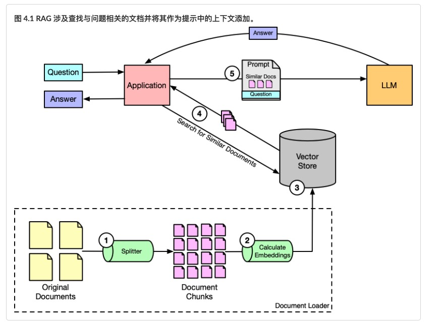
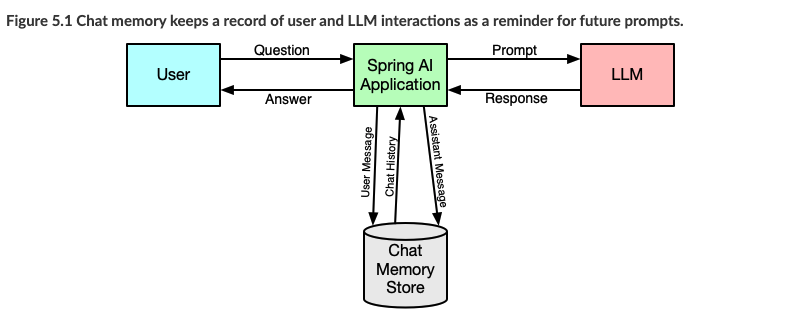
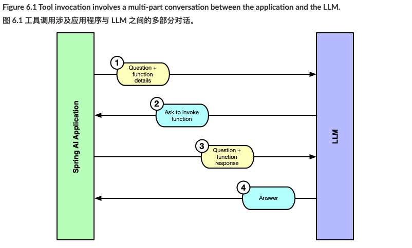
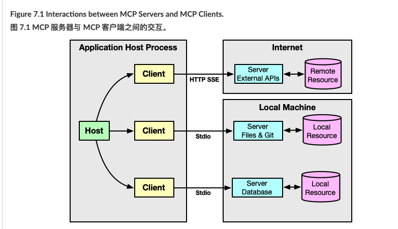
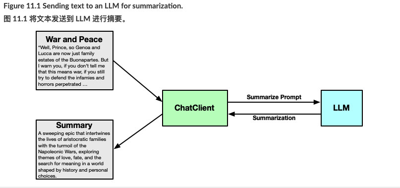
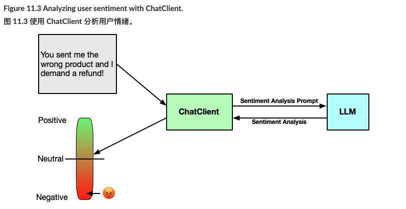

#### RAG

#### CHAT MEMORY

#### TOOL

- By applying tools, LLMs can answer questions about data that is provided in real-time.
- 通过应用工具，LLMs 可以回答关于实时提供的数据的问题。
- Spring AI includes details about available tools when sending prompts to an LLM.
- Spring AI 在向 LLM 发送提示时会包含可用工具的详细信息。
- LLMs do not invoke tools directly, but instead respond to a prompt by asking the application to call one or more tools and then send a followup prompt that provides the tool results as additional context.
- LLM 不会直接调用工具，而是通过让应用程序调用一个或多个工具来响应提示，然后发送一个后续提示，该提示将工具结果作为附加上下文提供。
- Spring AI provides a consistent programming model for working with tools regardless of the model and API being used.
- Spring AI 为使用不同模型和 API 的工具提供了统一的编程模型。
- Tools can be defined as @Tool-annotated methods or as implementations of Java’s Function, Supplier, and Consumer interfaces.
- 工具可以定义为带有 @Tool 注解的方法，或者定义为 Java 的 Function 、 Supplier 和 Consumer 接口的具体实现

#### MCP TOOL

Interactions between MCP Servers and MCP Clients.

- Model Context Protocol (MCP) is a specification proposed by Anthropic to standardize how to create reusable modules of tools, prompts, and resources for GenAI.
模型上下文协议（MCP）是由 Anthropic 提出的一项规范，旨在标准化如何为生成式人工智能（GenAI）创建可重用的工具、提示和资源模块。
- Spring AI also provides both client and server side support for working with MCP.
Spring AI 也提供了客户端和服务器端的支持，用于与 MCP 协同工作。
- There are already over 1,000 MCP Servers available publicly that you can use in a Spring AI application to enable functionality beyond what an LLM is capable of on its own.
目前已有超过 1,000 个 MCP 服务器公开发布，您可以在 Spring AI 应用程序中使用这些服务器，以实现超出单个 LLM 自身能力范围的功能。
- Spring AI’s MCP supports both STDIO and HTTP+SEE transports for communication between a client and server.
Spring AI 的 MCP 支持 STDIO 和 HTTP+SEE 传输方式，用于客户端和服务器之间的通信。

#### 文生图/音频
Spring AI enables integration with models that support audio and images.
Spring AI 能够与支持音频和图像的模型集成。
When working with OpenAI or Azure OpenAI, the transcription model makes it possible for your application to "listen" to audio files and produce textual transcriptions of those files.
在使用 OpenAI 或 Azure OpenAI 时，转录模型可以让您的应用程序"听"音频文件，并生成这些文件的文本转录。
Also with OpenAI, you can generate audio files from text with Spring AI’s SpeechModel.
此外，通过 OpenAI，您可以使用 Spring AI 的 SpeechModel 从文本生成音频文件。
You can add vision to your application (for underlying models that support it) by simply adding an image Resource to the prompt and asking questions about the image.
您可以通过在提示中简单地添加图像 Resource 并询问有关图像的问题，为您的应用程序添加视觉功能（适用于支持该功能的底层模型）。
Spring AI can also be used to generate images from text for models that support image generation.
Spring AI 也可以用于从文本生成图像，适用于支持图像生成的模型。

#### 观测
- Spring AI exposes several metrics via Micrometer that pertain to Generative AI operations, vector store operations, and Spring AI’s ChatClient and advisors.
Spring AI 通过 Micrometer 暴露了多个与生成式 AI 操作、向量存储操作以及 Spring AI 的 ChatClient 和顾问相关的指标。
- These metrics can be consumed via the Actuator’s metrics endpoint or scraped by Prometheus for displaying as time-series graphs.
这些指标可以通过 Actuator 的指标端点进行消费，或由 Prometheus 抓取以显示为时间序列图。
- By building a dashboard in Grafana that retrieve the metrics from Prometheus, you can gain visibility into all of the Generative AI activity in your application.
通过在 Grafana 中构建一个从 Prometheus 获取指标的仪表板，你可以获得有关应用程序中所有生成式 AI 活动的可见性。
- To gain deeper insight into how Generative AI is used in your application, Spring AI also publishes tracing data that can be viewed in tracing tools such as Jaeger or Zipkin.
为了更深入地了解生成式 AI 在你的应用程序中的使用情况，Spring AI 还发布可追溯数据，这些数据可以在 Jaeger 或 Zipkin 等可追溯工具中查看。

#### SECURITY

- Security is an important aspect of any application, including those built upon Generative AI.
安全性是任何应用程序的重要方面，包括基于生成式 AI 构建的应用程序。
- Using Spring Security, you can restrict access to tool calls and documents in a vector store to only users authorized to access them.
使用 Spring Security，你可以限制对向量存储中的工具调用和文档的访问，仅授权用户可以访问。
- The non-deterministic nature of Generative AI along with the flexibility of natural language leave opportunities for hackers to use GenAI applications in unintended and harmful ways.
生成式 AI 的非确定性特性以及自然语言的灵活性为黑客利用 GenAI 应用程序以非预期和有害的方式提供了机会。
- Spring AI’s SafeGuardAdvisor, as well as custom advisors, can be applied to prevent and mitigate the impact of adversarial prompting techniques.
Spring AI 的 SafeGuardAdvisor 以及自定义顾问可以用于防止和减轻对抗性提示技术的影响。

#### 应用生成式 AI 模式

##### 摘要summarization

#### Analyzing sentiment 分析情感

- Spring AI’s ChatClient is useful for much more than simply answering questions.
Spring AI 的 ChatClient 不仅用于回答问题，还有更多用途。
- ChatClient can be used to summarize text, distilling it into the essentials and a more easily digestible form.
ChatClient 可用于总结文本，将其提炼成核心要点和更易于理解的形式。
- Internationalizing responses is made much simpler by leveraging ChatClient and the underlying LLM to translate text from one language to another.
利用 ChatClient 和底层 LLM，可以更简单地实现响应的国际化，将文本从一种语言翻译成另一种语言。
- Figuring out a user’s sentiment is another way to leverage ChatClient and Generative AI.
确定用户的情感是利用 ChatClient 和生成式 AI 的另一种方式。
- Ultimately, it’s how prompts are written that determine what ChatClient can do, making it capable of many things.
归根结底，是提示语如何编写决定了 ChatClient 能做什么，使其能够实现许多功能。