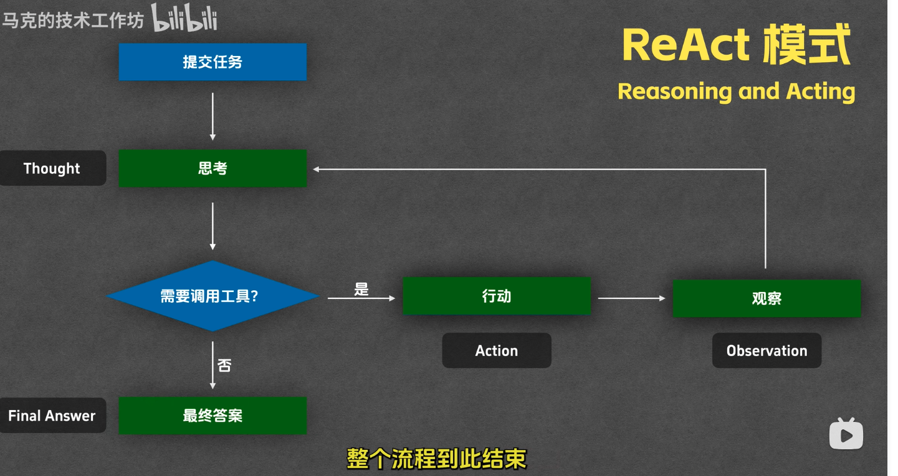
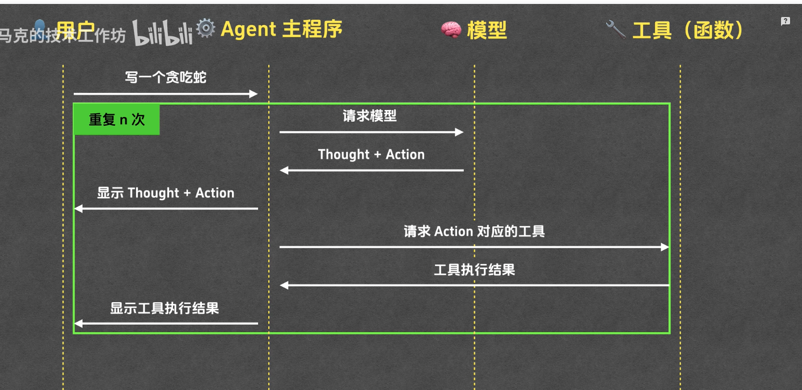
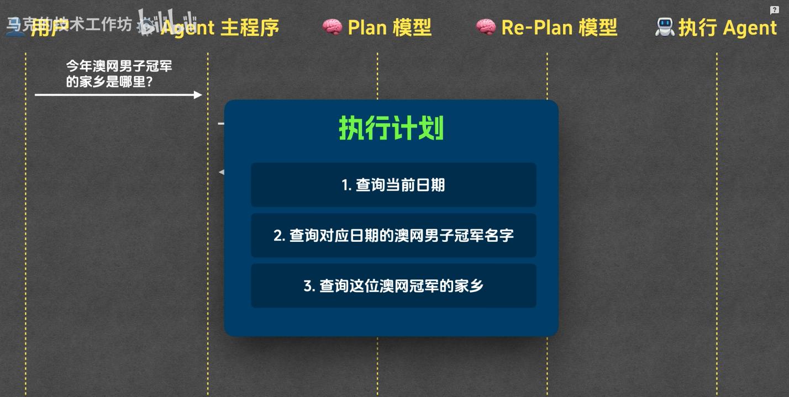
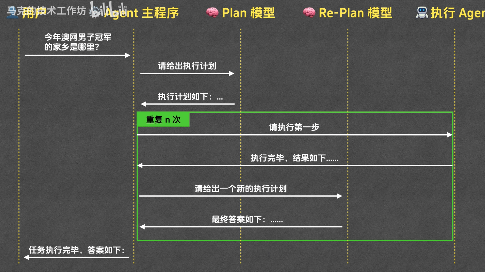
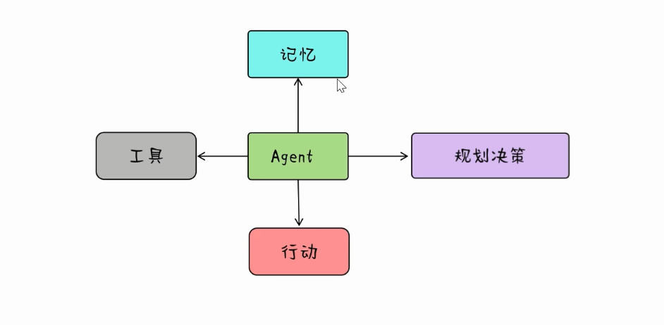

#### 什么是agent

把大模型和工具结合起来，变成一个能感知和改变外部环境的智能程序。

Agent智能体是一种能够感知环境、进行决策和执行动作的智能实体

指一种能够模拟人类思考方式和行为来自动执行任务，以解决复杂问题的程序或系统

具备感知、推理、决策与执行能力的 “行动者”，可自主完成复杂任务。

#### agent 的运行模式

react 模式 ： reasoning and acting

1. 提交任务（task）
2. 大模型思考(thought)，是不是要调用工具
3. 如果需要，就行动（action）
3. 如果不需要，给出最终答案
4. 行动完成后,查看工具的执行结果（observation）
,写入是否成功等,然后继续思考是否需要调用工具，在走一遍流程

主要流程，thought -> action -> observation -> final answer

react 模式是怎么实现的？
系统提示词：
1. 模型角色
2. 运行规则
3. 环境信息
4. 

plan and execute agent

