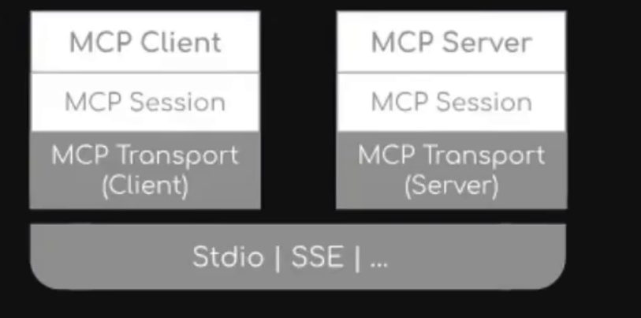

#### mcp

它为连接 AI 系统和数据源提供了一个通用的开放标准，用单一协议取代了分散的集成。结果是 AI 系统可以更简单、更可靠地访问其所需的数据。

实现跨模型，跨回话的上下文信息持久化和动态共享

ai chat : 手动复制调试

ai composer： 局部修改

ai agent : 端对端的任务闭环，自主决策，自动执行

基于json-rpc 构建，提供有状态回话协议，专注客户端与服务端的上下文交换和采样协调

mcp host : 运行AI模型或代理的宿主程序，如果claude 桌面版，cline cursor等，主机应用通过内置的mcp client 与外部建立连接，是连接的发起方

mcp client : 嵌入在主机中的协议客户端组件，每个mcp 客户端与一个特定的mcp 服务器保持一对一的连接，一个主机应用中可以包含多个客户端，从而连接多个服务端

mcp server : 独立运行的轻量程序，封装某个数据源或者具体的功能。将底层的的数据源或者工具通过统一的标准协议暴露.

传输方式：
- stdio 执行命令的方式
- http sse 客户端与服务端建立连接后，由服务端向客户端推送消息，单向的。
- 基于spring 的传输： webflux sse  webmvc sse4.3 

java 的sdk遵循分层结构

mcpclient/mcpserver : 两者都使用mcpsession进行同步/异步操作
mcpsession： 使用defaulMcpSession 实现通信模式和状态
mcptransport： 通过一下方式处理json-rpc消息序列化和反序列化

核心模块中的stdiotransport
专用传输模块（java httpclient,spring webflux,spring webmvc）中的http sse 传输

  mcp 服务器主要提供三种主要类型的功能
  1. resources ： 资源。 客户端读取类似文件的数据
  2. tools : 工具，可以由LLM调用的函数（API）
  3. prompts : 提示，帮助用户完成特定任务的预先编写的模板

 