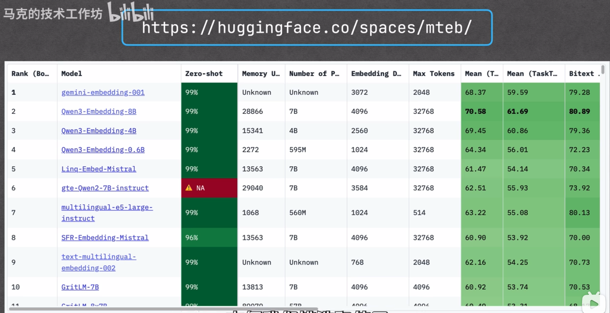
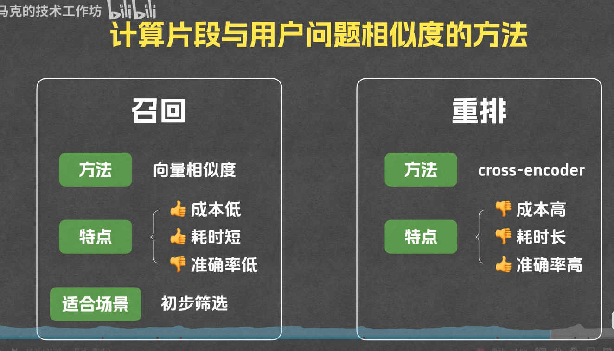
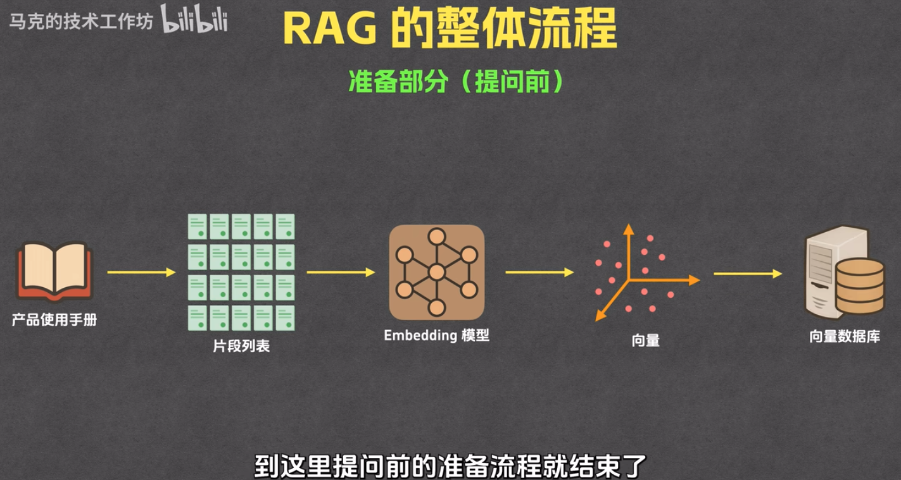
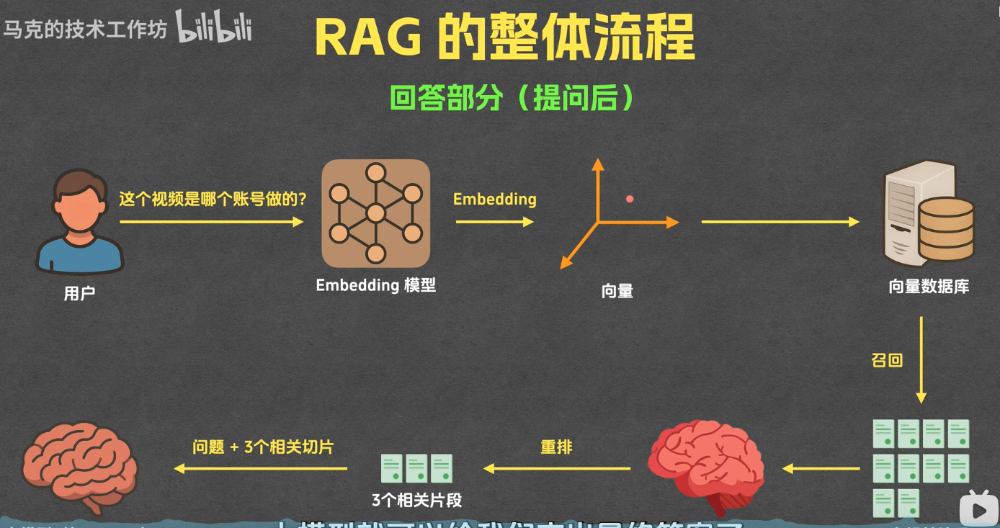

#### rag
检索增强生成

1. 分段（分片）：把文档分段， 针对提问找相关的片段
2. 

#### rag的基本流程

- 准备：分片 -> 索引

分片
1. 按字数分
2. 按段落分
3. 按章节分
4. 按页码分
 
索引
1. 通过emberdding 将片段文本转换为向量
2. 将片段文本和片段向量存入向量数据库中

向量：有大小有方向的量，如【1.0，2.3，5.78】，一维向量，二维向量等
  
emberdding : 把文本转换成向量的过程
(首先把问题转换成向量，然后再把这个向量和rag中的向量做对比，找出最相近的向量)

向量数据库： 用来存储和查询向量的数据库,提供向量相似度等相关函数。既存储向量和存储文本

- 回答（提问后）：召回->重排->生成

召回：搜索与用户问题相关的片段

1. 用户问题 -> embedding模型 -> 转为向量（【11，5，3，4，5】） -> 查询向量数据库 -> 返回10个最相似结果(计算相似度)
2. 相似度的计算： 相似度（问题/库里的向量）=相似度，
计算方法：
1. 余弦相似度：两个向量的夹角求cosin值,夹角越小，相似度越高
2. 欧氏距离：计算两个向量点的距离，距离越小，相似度越高
3. 点积：A和B引入直线，用B的起点到垂直线的点之间的距离乘以B的长度，乘积越大，相似度越高。

重排：重新排列,从返回的10份中，再挑3份与用户问题最相似的。使用的计算文档相似度不一样,用cross-encoder

   

生成： 把三个片段发给大模型，得到结果

#### 整体流程

