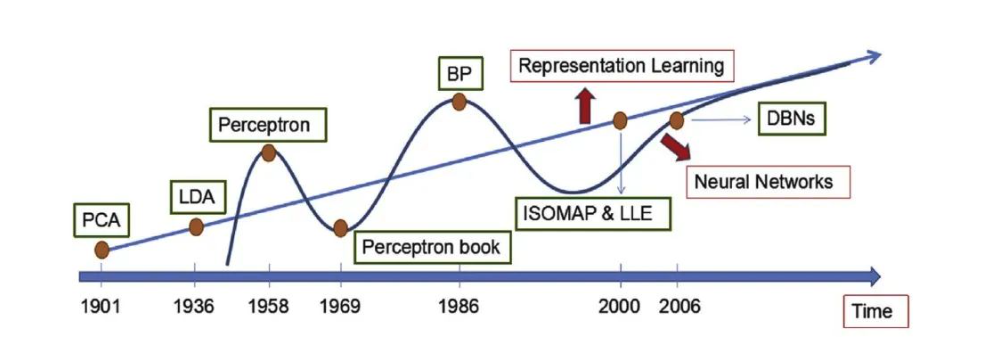
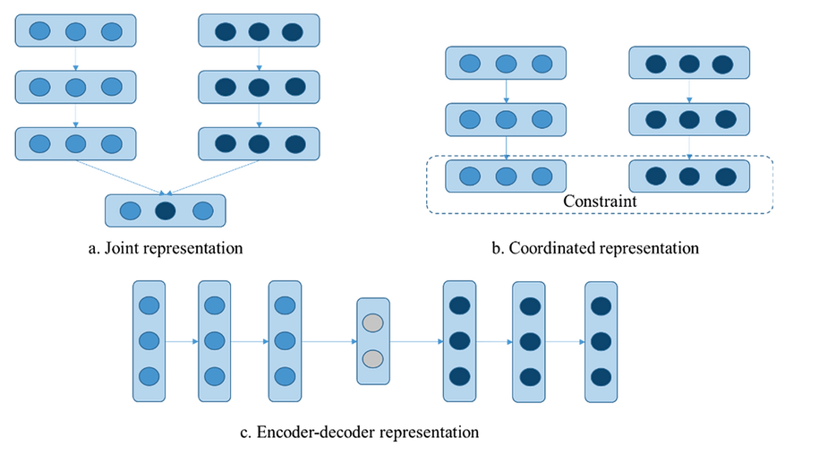
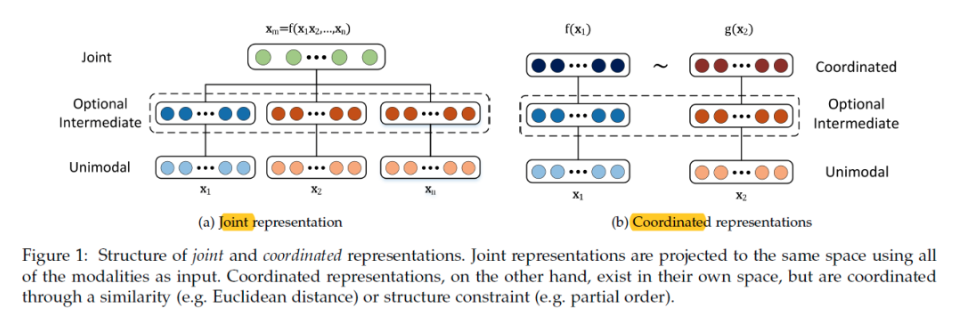
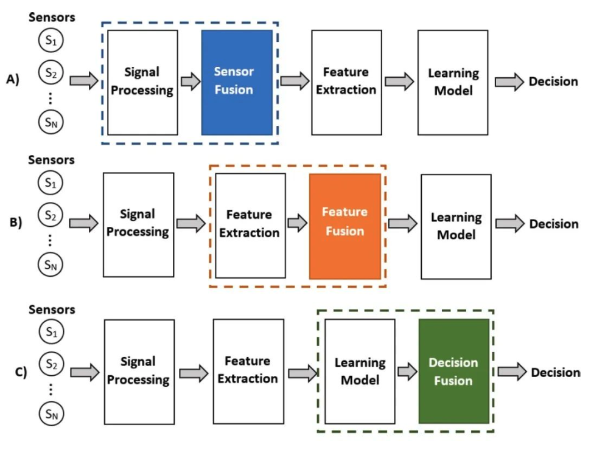
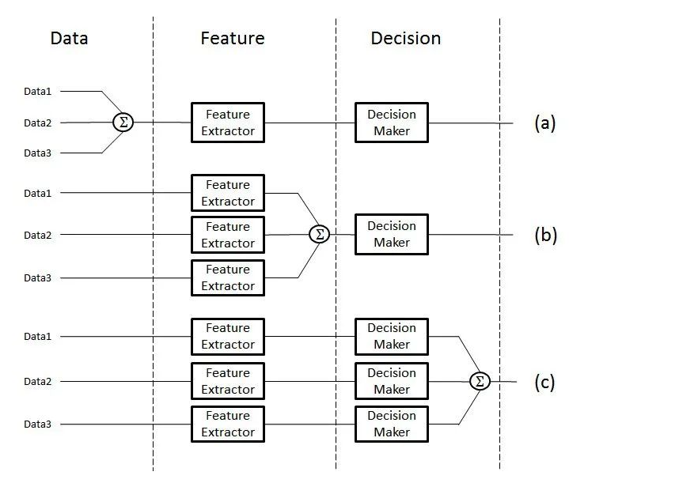
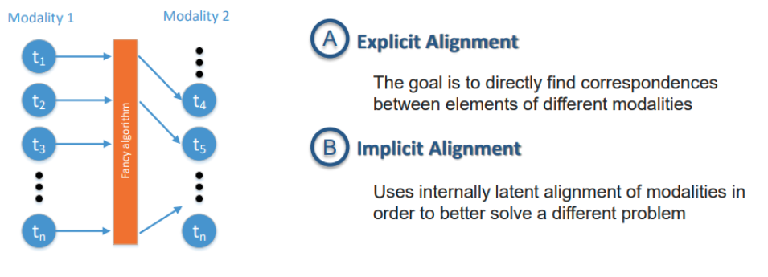
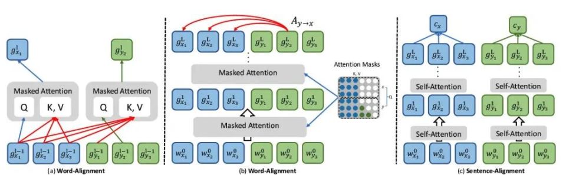
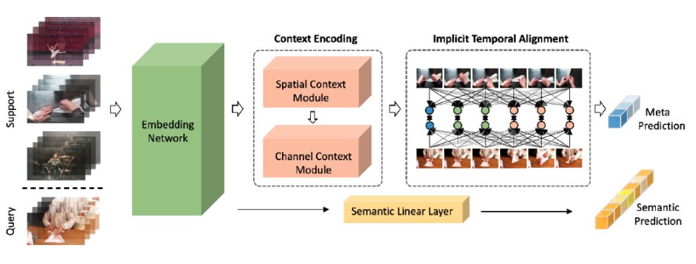

#### 多模态学习
多模态学习（Multimodal Learning）是一种利用来自不同感官或交互方式的数据进行学习的方法，这些数据模态可能包括文本、图像、音频、视频等。多模态学习通过融合多种数据模态来训练模型，从而提高模型的感知与理解能力，实现跨模态的信息交互与融合。

##### 模态表示
模态表示是将不同感官或交互方式的数据（如文本、图像、声音等）转换为计算机可理解和处理的形式，以便进行后续的计算、分析和融合。

文本模态的表示：文本模态的表示方法有多种，如独热表示、低维空间表示（如通过神经网络模型学习得到的转换矩阵将单词或字映射到语义空间中）、词袋表示及其衍生出的n-grams词袋表示等。目前，主流的文本表示方法是预训练文本模型，如BERT。

视觉模态的表示：视觉模态分为图像模态和视频模态。图像模态的表示主要通过卷积神经网络（CNN）实现，如LeNet-5、AlexNet、VGG、GoogLeNet、ResNet等。视频模态的表示则结合了图像的空间属性和时间属性，通常由CNN和循环神经网络（RNN）或长短时记忆网络（LSTM）等模型共同处理。

声音模态的表示：声音模态的表示通常涉及音频信号的预处理、特征提取和表示学习等步骤，常用的模型包括深度神经网络（DNN）、卷积神经网络（CNN）和循环神经网络（RNN）等。

表征学习（Representation Learning）旨在从原始数据中自动提取有效特征，形成计算机可理解的模态表示，以保留关键信息并促进跨模态交互与融合。

表征学习（Representation Learning） ≈ 向量化（Embedding）-- 架构师带你玩转AI

什么是多模态联合表示（Joint Representation）？

多模态联合表示是一种将多个模态（如文本、图像、声音等）的信息共同映射到一个统一的多模态向量空间中的表示方法。

多模态联合表示通过神经网络、概率图模型将来自不同模态的数据进行融合，生成一个包含多个模态信息的统一表示。这个表示不仅保留了每个模态的关键信息，还能够在不同模态之间建立联系，从而支持跨模态的任务，如多模态情感分析、视听语音识别等。

什么是多模态协同表示（Coordinated Representation）？

多模态协同表示是一种将多个模态的信息分别映射到各自的表示空间，但映射后的向量或表示之间需要满足一定的相关性或约束条件的方法。这种方法的核心在于确保不同模态之间的信息在协同空间内能够相互协作，共同优化模型的性能。

##### 多模态融合
什么是多模态融合（MultiModal Fusion）？

多模态融合能够充分利用不同模态之间的互补性，它将抽取自不同模态的信息整合成一个稳定的多模态表征。从数据处理的层次角度将多模态融合分为数据级融合、特征级融合和目标级融合。

1. 数据级融合（Data-Level Fusion）：
- 数据级融合，也称为像素级融合或原始数据融合，是在最底层的数据级别上进行融合。这种融合方式通常发生在数据预处理阶段，即将来自不同模态的原始数据直接合并或叠加在一起，形成一个新的数据集。
- 应用场景：适用于那些原始数据之间具有高度相关性和互补性的情况，如图像和深度图的融合。

2. 特征级融合（Feature-Level Fusion）：
- 特征级融合是在特征提取之后、决策之前进行的融合。不同模态的数据首先被分别处理，提取出各自的特征表示，然后将这些特征表示在某一特征层上进行融合。
- 应用场景：广泛应用于图像分类、语音识别、情感分析等多模态任务中。

3. 目标级融合（Decision-Level Fusion）：
- 目标级融合，也称为决策级融合或后期融合，是在各个单模态模型分别做出决策之后进行的融合。每个模态的模型首先独立地处理数据并给出自己的预测结果（如分类标签、回归值等），然后将这些预测结果进行整合以得到最终的决策结果。

- 应用场景：适用于那些需要综合考虑多个独立模型预测结果的场景，如多传感器数据融合、多专家意见综合等。

##### 跨模态对齐
跨模态对齐是通过各种技术手段，实现不同模态数据（如图像、文本、音频等）在特征、语义或表示层面上的匹配与对应。跨模态对齐主要分为两大类：显式对齐和隐式对齐。

什么是显示对齐（Explicit Alignment）？

直接建立不同模态之间的对应关系，包括无监督对齐和监督对齐。

无监督对齐： 利用数据本身的统计特性或结构信息，无需额外标签，自动发现不同模态间的对应关系。
CCA（典型相关分析）： 通过最大化两组变量之间的相关性来发现它们之间的线性关系，常用于图像和文本的无监督对齐。

自编码器：通过编码-解码结构学习数据的低维表示，有时结合循环一致性损失（Cycle Consistency Loss）来实现无监督的图像-文本对齐。

监督对齐： 利用额外的标签或监督信息指导对齐过程，确保对齐的准确性。
多模态嵌入模型：如DeViSE（Deep Visual-Semantic Embeddings），通过最大化图像和对应文本标签在嵌入空间中的相似度来实现监督对齐。

多任务学习模型：同时学习图像分类和文本生成任务，利用共享层或联合损失函数来促进图像和文本之间的监督对齐。

什么是隐式对齐（Implicit Alignment）？

不直接建立对应关系，而是通过模型内部机制隐式地实现跨模态的对齐。这包括注意力对齐和语义对齐。

注意力对齐： 通过注意力机制动态地生成不同模态之间的权重向量，实现跨模态信息的加权融合和对齐。
Transformer模型：在跨模态任务中（如图像描述生成），利用自注意力机制和编码器-解码器结构，自动学习图像和文本之间的注意力分布，实现隐式对齐。

BERT-based模型：在问答系统或文本-图像检索中，结合BERT的预训练表示和注意力机制，隐式地对齐文本查询和图像内容。

语义对齐： 在语义层面上实现不同模态之间的对齐，需要深入理解数据的潜在语义联系。
图神经网络（GNN）：在构建图像和文本之间的语义图时，利用GNN学习节点（模态数据）之间的语义关系，实现隐式的语义对齐。

预训练语言模型与视觉模型结合：如CLIP（Contrastive Language-Image Pre-training），通过对比学习在大量图像-文本对上训练，使模型学习到图像和文本在语义层面上的对应关系，实现高效的隐式语义对齐。

