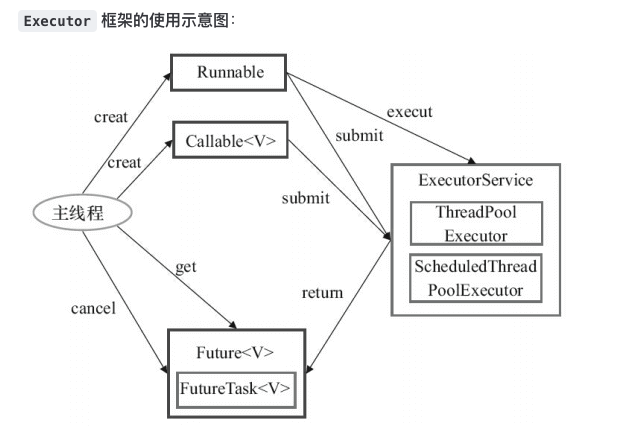
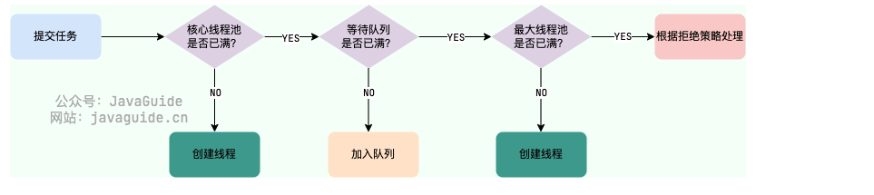

#### 线程

为什么需要多线程

1. 充分发挥多核CPU的资源
2. 当需要IO等待时，可以更充分利用计算机资源
3. 线程的创建及销毁比进程效率更高
4. 调度线程比调度进程更快

进程与线程的区别：
1. 进程包含线程，每个进程至少有一个线程，即主线程
2. 进程间不共享资源，进程内的线程共享资源
3. 进程是操作系统分配资源的最新单位，线程是操作系统调度资源的最小单位
4. 一个进程挂了不会影响到其他进程，一个线程挂了可能会影像到其他线程

操作系统的内核实现了线程，并提供API给用户层使用,java的thread标准库也是对API的抽象和封装。

创建线程：
1. 继承Thread 类
2. 实现runnable 接口
3. 匿名内部类创建Thread类的子类对象
4. 使用lambda表达式创建Runnable子类对象

线程的所有状态：
1. NEW : 
2. RUNNABLE
3. BLOCKED
4. WAITING
5. TIMED_WAITING
6. TERMINATED

#### 线程池 executor
线程池好处：
1. 降低资源消耗：可以重复利用已创建的线程，降低线程创建和销毁造成的资源消耗；
2. 提高响应速度：当任务到达时，任务不需要等到线程创建就可以执行
3. 提高现线程的可管理性：线程池可以统一对线程进行分配、调优和监控

###### Executor线程池框架

Executor 除了高效管理线程外，还解决了this逃逸的问题
···
  this逃逸问题是指在构造函数未返回之前其他线程就持有该对象的引用，调用尚未构造完成的对象的方法可能引发令人疑惑的错误
···

##### ThreadPoolExecutor 拒绝策略定义

- ThreadPoolExecutor.AbortPolicy：抛出 RejectedExecutionException来拒绝新任务的处理。
- ThreadPoolExecutor.CallerRunsPolicy：调用执行自己的线程运行任务，也就是直接在调用execute方法的线程中运行(run)被拒绝的任务，如果执行程序已关闭，则会丢弃该任务。因此这种策略会降低对于新任务提交速度，影响程序的整体性能。如果您的应用程序可以承受此延迟并且你要求任何一个任务请求都要被执行的话，你可以选择这个策略。
- ThreadPoolExecutor.DiscardPolicy：不处理新任务，直接丢弃掉。
- ThreadPoolExecutor.DiscardOldestPolicy：此策略将丢弃最早的未处理的任务请求。

##### Executor的类型
- FixedThreadPool：固定线程数量的线程池。该线程池中的线程数量始终不变。当有一个新的任务提交时，线程池中若有空闲线程，则立即执行。若没有，则新的任务会被暂存在一个任务队列中，待有线程空闲时，便处理在任务队列中的任务。使用的是阻塞队列 LinkedBlockingQueue，任务队列最大长度为 Integer.MAX_VALUE
  
- SingleThreadExecutor： 只有一个线程的线程池。若多余一个任务被提交到该线程池，任务会被保存在一个任务队列中，待线程空闲，按先入先出的顺序执行队列中的任务。使用的是阻塞队列 LinkedBlockingQueue，任务队列最大长度为 Integer.MAX_VALUE
  
- CachedThreadPool： 可根据实际情况调整线程数量的线程池。线程池的线程数量不确定，但若有空闲线程可以复用，则会优先使用可复用的线程。若所有线程均在工作，又有新的任务提交，则会创建新的线程处理任务。所有线程在当前任务执行完毕后，将返回线程池进行复用。使用的是同步队列 SynchronousQueue, 允许创建的线程数量为 Integer.MAX_VALUE
  
- ScheduledThreadPool：给定的延迟后运行任务或者定期执行任务的线程池.使用的无界的延迟阻塞队列DelayedWorkQueue，任务队列最大长度为 Integer.MAX_VALUE

默认线程数为Integer.MAX_VALUE, 可能堆积大量的请求，从而导致 OOM.

#### 线程池执行任务的流程
1. 如果当前运行的线程数小于核心线程数，那么就会新建一个线程来执行任务(调用addWork()方法)。
2. 如果当前运行的线程数等于或大于核心线程数，但是小于最大线程数，那么就把该任务放入到任务队列里等待执行(workQueue.offer(任务))。
3. 如果向任务队列投放任务失败（任务队列已经满了），但是当前运行的线程数是小于最大线程数的，就新建一个线程来执行任务(调用addWork()方法)。
4. 如果当前运行的线程数已经等同于最大线程数了，新建线程将会使当前运行的线程超出最大线程数，那么当前任务会被拒绝，拒绝策略会调用RejectedExecutionHandler.rejectedExecution()方法。

##### Runnable 和 Callable的区别
1. Runnabel接口不返回结果和抛出异常，Callable返回结果或抛出异常
2. Callable通过Future对象处理结果或异常

#### Threadlocal、InheritableThreadLocal和TransmittableThreadlocal

##### ThreadLocal:

ThreadLocal提供线程的局部变量，每个线程都可以通过get()和set()对局部变量进行操作而不会对其他线程的局部变量产生影响，实现了线程之间的数据隔离。e.g. 数据库的连接池管理。

- 每个Thread维护着一个ThreadLocalMap的引用
- ThreadLocalMap是ThreadLocal的内部类，用Entry来进行存储
- 调用ThreadLocal的set()方法时，实际上就是往ThreadLocalMap设置值，key是ThreadLocal对象，值是传递进来的对象
- 调用ThreadLocal的get()方法时，实际上就是往ThreadLocalMap获取值，key是ThreadLocal对象
- ThreadLocal本身并不存储值，它只是作为一个key来让线程从ThreadLocalMap获取value。

不足：无法完成父子线程之间的数据传递。

ThreadlocalMap:ThreadLocal的内部类型，实际是Entry数组(开方地址法，hash冲突的情况则下标挪一位再找; 继承弱引用，当堆空间不足时，会清理未被引用的entry)，也是ThreadLocalMap的内部类
ThreadlocalMap.set():如果map不为空，set值，如果map为空，createMap在set值
ThreadlocalMap.get():如果为空，返回null，否则返回结果

##### InheritableThreadLocal
ThreadLocal的升级版，jdk原生，实现了父子线程之间的数据传递。

- 重新开辟一块空间（InheritableThreadLocal）用于存储父子线程共用的数据隔离空间。重写了ThreadLocal的三个方法，当创建新线程的时候，将父线程的ThreadLocal值拷贝到子线程。
  
不足：无法完成线程池间的数据传递。

1. 先获取父线程的所有变量(ThreadLocalMap parentMap)
2. 循环复制父线程的中entry

##### TransmittableThrealLocal
阿里开源组件，继承自InheritableThreadLocal，实现了父子线程在线程池中的数据传递。
- 在提交任务给线程池时，将ThreadLocal数据一起提交，相当于重新set一次ThreadLocal，「把任务提交给线程池时的ThreadLocal值传递到 任务执行时」。
- 与InheritableThreadLocal类似，单独搞了一块空间，维护一个全局的静态变量holder，存储所有TransmittableThreadLocal实例

不足：对hystrix修饰的线程池无效，因为hytrix做了线程隔离。

1. 通过TtlExecutor创建线程
2. 通过Ttlrunnbale对Runnable和Callable增强

流程：
- 获取所有的ttl及tl快照内容(capturedRef.get(),从主线程传递下来的ThreadLocal值)
- 重放获取到捕获的TransmittableThreadLocal和注册的ThreadLocal值，并返回当前子线程所有存在的变量(replay(captured))
- 执行线程任务
- 恢复线程到执行replay方法之前的TTL值(restore(backup);)