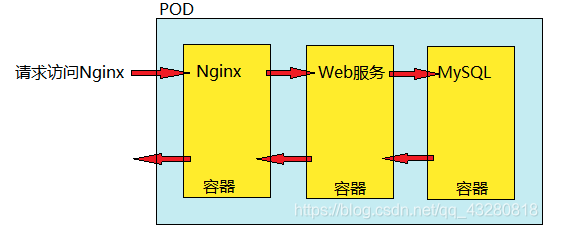
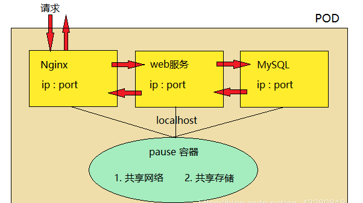
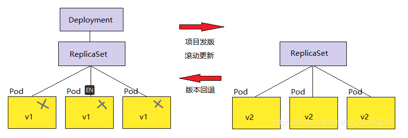
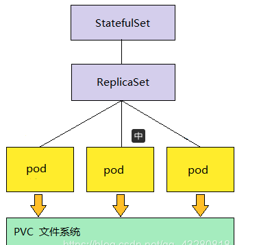

#### kubernetes

k8s 是由 Google 公司 用go 语言开发的。google 在全球有相当多的服务器，当然需要一个管理软件。Google内部本身就有一个叫 borg 的系统云平台管理工具，已经使用了十几年。后来参照 borg 系统架构开发了 k8s，主要用它来编排、管理容器，为容器化的应用提供部署运行、资源调度、服务发现和动态伸缩等一系列完整功能，提高了大规模容器集群管理的便捷性。
- 可移植: 支持公有云，私有云，混合云，多重云（multi-cloud）
- 可扩展: 模块化，插件化，可挂载，可组合
- 自动化: 自动部署，自动重启，自动复制，自动伸缩/扩展

运维层面的提效
1. 自动扩缩容
2. 服务发现
3. 负载均衡
4. 滚动更新

#### pod k8s 最小的调度单位

- pod 也可以理解是一个容器，装的是 docker 创建的容器，也就是用来封装容器的一个容器；
- pod 是一个虚拟化分组， 有自己的 IP 地址和主机名 hostname，利用 namespace 进行资源隔离，相当于一台独立沙箱环境；
- pod 相当于一台独立主机，内部可以封装一个或多个容器(通常是一组相关的容器)，内部容器之间访问采用 localhost。

pod部署一个或一组服务

##### pod 底层网络和数据存储是如何进行的

- pod 内部容器创建之前，必须先创建 pause 容器。pause 有两个作用：共享网络和共享存储。
- 每个服务容器共享 pause 存储，不需要自己存储数据，都交给 pause维护。
- pause 也相当于这三个容器的网卡，因此他们之间的访问可以通过 localhost 方式访问，相当于访问本地服务一样，性能非常高（就像本地几台虚拟机之间可以 ping 通）。

#### ReplicaSet 副本控制器

管理控制 pod 副本（服务集群）的数量，以使其永远与预期设定的数量保持一致。

##### ReplicaSet 和 ReplicationController 的区别
都是管理pod的副本
不同点：标签选择器的功能不同
ReplicaSet 可以使用标签选择器进行 单选 和 复合选择；而 ReplicationController 只支持 单选操作。

#### Deployment 部署对象
滚动更新
单独的 ReplicaSet 是不支持滚动更新的，Deployment 对象支持滚动更新，通常和 ReplicaSet 一起使用。
需要滚动更新时的步骤：
1. Deployment 建立新的 Replicaset
2. Replicaset 重新建立新的 pod

所以它们之间是有层次关系的，Deployment 管 Replicaset，Replicaset 维护 pod。在更新时删除的是旧的 pod，老版本的 ReplicaSet 是不会删除的，所以在需要时还可以回退以前的状态。

#### StatefulSet 部署有状态服务
思考：如果 MySQL(有状态服务) 使用容器化部署，会存在什么问题？

- 容器都是有生命周期的，一旦宕机数据就很可能丢失
- pod 也有生命周期的，用 pod 部署时把 pod 集群副本重启以后也可能会出现数据丢失
  
因此对 k8s 来说，不能使用 Deployment 部署有状态的服务。通常情况下，Deployment 被用来部署无状态服务。
然后 StatefulSet 就是为了解决有状态服务使用容器化部署的一个问题。

#### StatefulSet的部署模型
StatefulSet 的部署模型和 Deployment 的很相似。
比如下图，借助 PVC(与存储有关) 文件系统来存储的实时数据，因此下图就是一个有状态服务的部署。
在 pod 宕机之后重新建立 pod 时，StatefulSet 通过保证 hostname 不发生变化来保证数据不丢失。因此 pod 就可以通过 hostname 来关联(找到) 之前存储的数据。

#### 如何理解状态服务
- 有状态服务
1. 有实时的数据需要存储
2. 在有状态服务集群中，如果把某一个服务抽离出来，一段时间后再加入回集群网络，此后集群网络会无法使用
-无状态服务
1. 没有实时的数据需要存储
2. 在无状态服务集群中，如果把某一个服务抽离出去，一段时间后再加入回集群网络，对集群服务无任何影响，因为它们不需要做交互，不需要数据同步等等。   