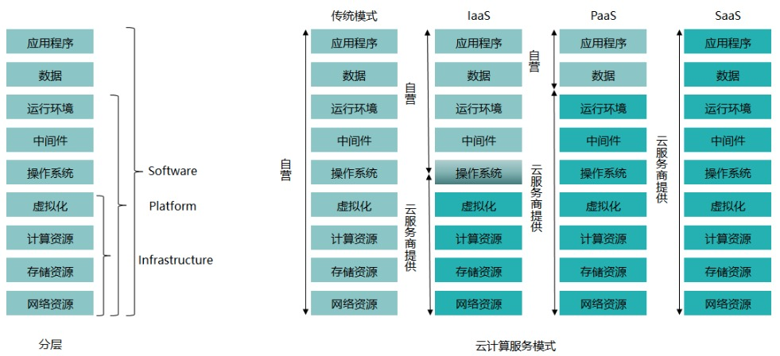

#### 云计算的部署模式





 1. IaaS：Infrastructure-as-a-Service（基础设施即服务）

···
IaaS（Infrastructure as a Service），即基础设施即服务。指把IT基础设施作为一种服务通过网络对外提供，并根据用户对资源的实际使用量或占用量进行计费的一种服务模式.
···

在这种服务模型中，普通用户不用自己构建一个数据中心等硬件设施，而是通过租用的方式，利用 Internet从IaaS服务提供商获得计算机基础设施服务，包括服务器、存储和网络等服务。

目前，IaaS在云计算服务模式中最为常用。

简单来说，IaaS就是云服务商提供计算、网络、存储等基础设施服务，也就是提供了虚拟化出来的硬件设备。用户需要在虚拟化出来的硬件设备上自行安装操作系统和各种软件。


2. PaaS：Platform-as-a-Service（平台即服务）

```
PaaS是（Platform as a Service）的缩写，是指平台即服务。 把服务器平台作为一种服务提供的商业模式，通过网络进行程序提供的服务称之为SaaS(Software as a Service)，而云计算时代相应的服务器平台或者开发环境作为服务进行提供就成为了PaaS(Platform as a Service)。
```

所谓PaaS实际上是指将软件研发的平台作为一种服务，以SaaS的模式提交给用户。因此，PaaS也是SaaS模式的一种应用。但是，PaaS的出现可以加快SaaS的发展，尤其是加快SaaS应用的开发速度。在2007年国内外SaaS厂商先后推出自己的PAAS平台。

目前，PaaS在云计算服务模式中使用最少。

简单来说，PaaS就是云服务商不仅提供了计算、网络、存储等基础设施服务，还提供了运行在这些基础设施上的操作系统和运行环境。用户只需要在云服务商提供的服务基础上自行安装应用程序，管理数据即可。

3. SaaS：Software-as-a-Service（软件即服务）

```
SaaS，是Software-as-a-Service的缩写名称，意思为软件即服务，即通过网络提供软件服务。
```

SaaS平台供应商将应用软件统一部署在自己的服务器上，客户可以根据工作实际需求，通过互联网向厂商定购所需的应用软件服务，按定购的服务多少和时间长短向厂商支付费用，并通过互联网获得SaaS平台供应商提供的服务。

简单来说，SaaS就是云服务商不仅提供了计算、网络、存储等基础设施服务，也提供了操作系统和运行环境，还提供了运行在该环境下的应用程序。用户可以直接使用云服务商提供的应用程序，不用担心如何进行维护。
