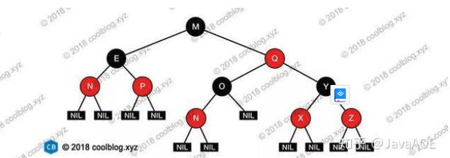
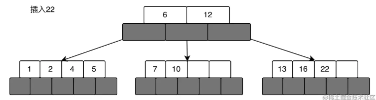
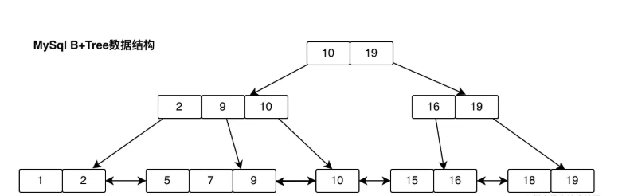

#### 红黑树的定义

红黑树是一种自平衡的二叉查找树, 又称为二叉B树。可以在O（log n）时间内完成查找、新增、删除等操作，Java的TreeMap、HashMap都是基于红黑树结构实现

它的主要特点：
1. 根节点是黑色
2. 节点是红色或者是黑色
3. 所有叶子都是黑色
4. 每个节点到叶子节点黑色节点数量相同
5. 每个红色节点必须有两个黑色子节点

每页16K

问题：
1.读取浪费太多；
2.磁盘读取次数过多

#### BTree
1. 节点最多含有n颗子树（指针），n-1个关键字（数字存储空间），n>=2;
2. 除了根节点和叶子节点外，其他每个节点至少有M（n/2）个子节点,M向上 取整，即分裂的时候从中间分开，分成M颗树；
3. 若根节点不是叶子节点，则至少有两颗子树。

问题：

1. BTree不适合范围查找。就拿上面的来举例，比如我要查找小于6的数据，则先找到6的节点，然后需要遍历一遍6节点(索引)的左子树，不遍历的话，就拿不到小于6的这些数据了，也就说索引失效了，所以说不适合范围查找。
2. BTree的节点除了存储索引之外，还存储了数据本身，占用空间较大，但是磁盘的页大小是有限的(16KB左右)，因此，存储同样大小的数据，BTree显得比较高(相对B+Tree)，稳定性弱一些。

#### B+Tree

B+Tree和BTree的分裂过程类似，只是B+Tree
1. 非叶子节点不会存储数据，只存储索引值(指针地址)
2. 所有的数据都是存储在叶子节点，其目的是为了增加系统的稳定性。

1. 叶子节点连起来了，是一条有序的双向链表，目的是为了解决范围查找。比如需要查找小于9的数据，只要找到等于9的数据，然后将9的左边数据全部拿出来即可。
2. 非叶子节点不存数据，只存索引，空间利用更高效。
3. 数据的个数和节点一样多，换句话说，非叶子节点存的是其子树的最大或最小值。

