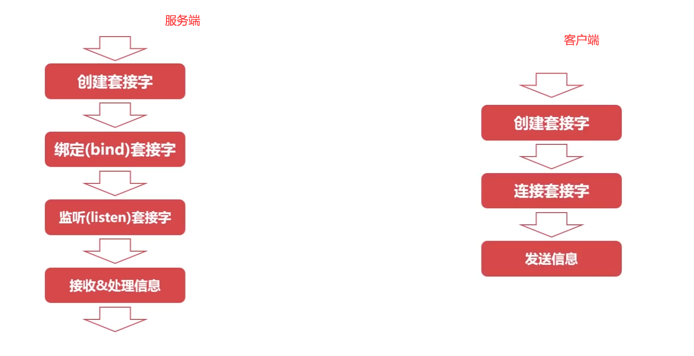
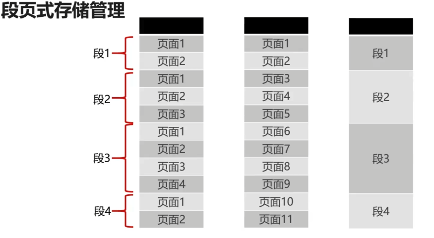
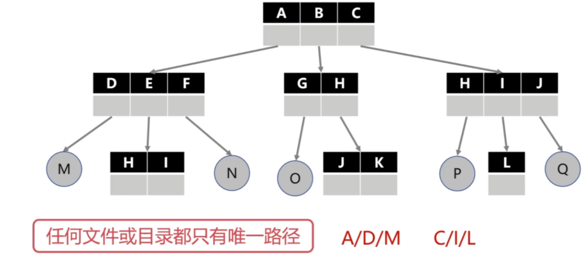
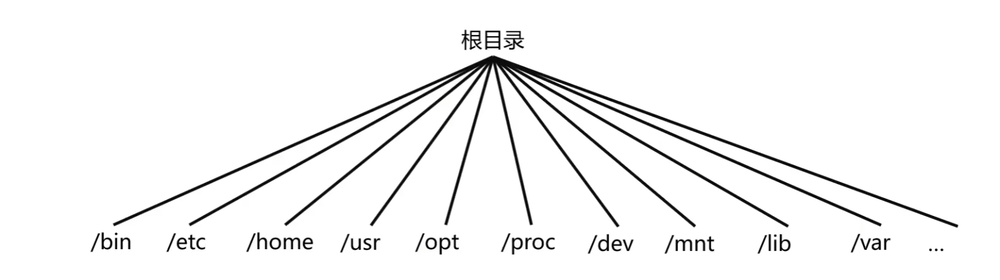
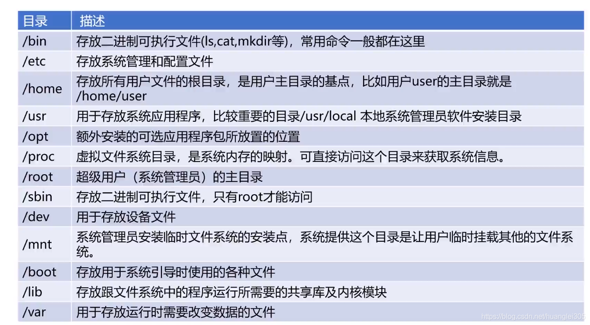
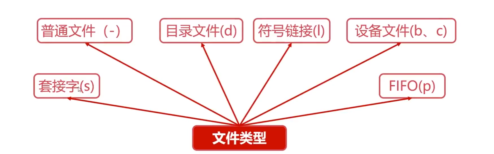

#### 操作系统

操作系统是控制管理计算机系统的硬软件，分配调度资源的系统软件。

1. 统一管理计算机资源：处理器资源，IO设备资源，存储器资源，文件资源;
2. 实现了对计算机资源的抽象：IO设备管理软件提供读写接口，文件管理软件提供操作文件;
3. 提供了用户与计算机之间的接口

操作系统特征：

（1）并行：指两个或多个事件可以在同一个时刻发生，多核CPU可以实现并行，一个cpu同一时刻只有一个程序在运行；

（2）并发：指两个或多个事件可以在同一个时间间隔发生，用户看起来是每个程序都在运行，实际上是每个程序都交替执行。

（3）共享性：操作系统的中资源可供多个并发的程序共同使用，这种形式称之为资源共享。

    互斥共享：当资源被程序占用时，其它想使用的程序只能等待。
    同时访问：某种资源并发的被多个程序访问。
    虚拟和异步特性前提是具有并发性。

（4）虚拟性：表现为把一个物理实体转变为若干个逻辑实体。

    时分复用技术：资源在时间上进行复用，不同程序并发使用，多道程序分时使用计算机的硬件资源，提高资源的利用率。
    空分复用技术：用来实现虚拟磁盘（物理磁盘虚拟为逻辑磁盘，电脑上的C盘、D盘等）、虚拟内存（在逻辑上扩大程序的存储容量）等，提高资源的利用率，提高编程效率。

（5）异步性：在多道程序环境下，允许多个进程并发执行，但由于资源等因素的限制，使进程的执行以“停停走走”的方式运行，而且每个进程执行的情况（运行、暂停、速度、完成）也是未知的。

#### 操作系统的中断处理

中断机制的作用：为了在多道批处理系统中让用户进行交互；

中断的分类：

内中断（也叫“异常”、“例外”、“陷入”）------- 信号来源：CPU内部，与当前执行指令有关；
外中断（中断）----------信号来源：CPU外部，与当前执行指令无关。

外中断的处理过程：

每执行完一个指令后，CPU都需要检查当前是否有外部中断 信号；
如果检查到外部中断信号，则需要保护被中断进程的CPU环境（如程序状态字PSW，程序计数器PC、各种通用寄存器）把他们存储在PCB（进程控制块中）；
根据中断信号类型转入相应的中断处理程序；
恢复原进程的CPU环境并退出中断，返回原进程继续执行

#### 进程管理

进程是系统进行资源分配和调度的基本单位；
进程作为程序独立运行的载体保障程序正常执行；
进程的存在使得操作系统资源的利用率大幅提升。

进程控制块（PCB）：用于描述和控制进程运行的通用数据结构,记录进程当前状态和控制进程运行的全部信息，是进程存在的唯一标识。

进程（Process）与线程（Thread）：

线程：操作系统进行**运行调度的最小单位**。
进程：系统进行**资源分配和调度的基本单位**。

区别与联系：
1. 一个进程可以有一个或多个线程；
2. 线程包含在进程之中，是进程中实际运行工作的单位；
3. 进程的线程共享进程资源；
4. 一个进程可以并发多个线程，每个线程执行不同的任务。

进程管理之五状态模型
- 就绪状态：其它资源（进程控制块、内存、栈空间、堆空间等）都准备好、只差CPU的状态。
- 执行状态：进程获得CPU，其程序正在执行。
- 阻塞状态：进程因某种原因放弃CPU的状态，阻塞进程以队列的形式放置。
- 创建状态：创建进程时拥有PCB但其它资源尚未就绪。
- 终止状态：进程结束由系统清理或者归还PCB的状态。

临界资源指的是一些虽作为共享资源却又无法同时被多个线程共同访问的共享资源。当有进程在使用临界资源时，其他进程必须依据操作系统的同步机制等待占用进程释放该共享资源才可重新竞争使用共享资源

进程同步的作用：对竞争资源在多进程间进行使用次序的协调，使得并发执行的多个进程之间可以有效使用资源和相互合作。

进程间同步的四原则：

1. 空闲让进：资源无占用，允许使用；
2. 忙则等待：资源被占用，请求进程等待；
3. 有限等待：保证有限等待时间能够使用资源；
4. 让权等待：等待时，进程需要让出CPU。

进程同步的方法

1. 使用fork系统调用创建进程：使用fork系统调用无参数，fork会返回两次，分别返回子进程id和0，返回子进程id的是父进程，返回0的是子进程。

- fork系统调用是用于创建进程的；
- fork创建的进程初始化状态与父进程一样；
- 系统会为fork的进程分配新的资源

2. 共享内存：在某种程度上，多进程是共同使用物理内存的，但是由于操作系统的进程管理，进程间的内存空间是独立的，因此进程默认是不能访问进程空间之外的内存空间的。

- 共享存储允许不相关的进程访问同一片物理内存；
- 共享内存是两个进程之间共享和传递数据最快的方式；
- 共享内存未提供同步机制，需要借助其他机制管理访问；

3. Unix域套接字
域套接字是一种高级的进程间通信的方法，可以用于同一机器进程间通信。

服务端和客户端分别使用Unix域套接字的过程：

线程同步的方法

- 互斥锁：互斥锁是最简单的线程同步的方法，也称为互斥量，处于两态之一的变量：解锁和加锁，两个状态可以保证资源访问的串行。 原子性：指一系列操作不可被中断的特性，要么全部执行完成，要么全部没有执行

- 自旋锁：自旋锁是一种多线程同步的变量，使用自旋锁的线程会反复检查锁变量是否可用，自旋锁不会让出CPU，是一种忙等待状态，即死循环等待锁被释放，自旋锁的效率远高于互斥锁。特点：避免了进程或者线程上下文切换的开销，但是不适合在单核CPU使用。

- 读写锁：是一种特殊的自旋锁，允许多个读操作同时访问资源以提高读性能，但是对写操作是互斥的，即**对多读少写的操作效率提升**很显著。

- 条件变量：是一种相对比较复杂的线程同步方法，条件变量允许线程睡眠，直到满足某种条件，当**满足条件时，可以给该线程信号通知唤醒**。

进程的类型

- 前台进程：具有终端，可以和用户交互；
- 后台进程：没有占用终端，基本不和用户交互，优先级比前台进程低（将需要执行的命令以“&”符号结束）；
- 守护进程：特殊的后台进程，在系统引导时启动，一直运行直到系统关闭（进程名字以“d”结尾的一般都是守护进程），如crond、sshd、httpd、mysqld…

操作Linux进程的相关命令：
- ps命令：列出当前的进程，结合-aux可以打印进程的详细信息（ps -aux）；
- top命令：查看所有进程的状态；
- kill命令：给进程发送信号。

#### 作业管理

作业管理之进程调度: 指计算机通过决策决定哪个就绪进程可以获得CPU使用权。

什么时候需要进程调度？
- 主动放弃：进程正常终止；运行过程中发生异常而终止；主动阻塞（如等待I/O）；
- 被动放弃：分给进程的时间片用完；有更高优先级的进程进入就绪队列；有更紧急的事情需要处理（如I/O中断）；

进程调度方式：

1. 非抢占式调度：只能由当前运行的进程主动放弃CPU；

- 处理器一旦分配给某个进程，就让该进程一直使用下去；
- 调度程序不以任何原因抢占正在被使用的处理器；
- 调度程序不以任何原因抢占正在被使用的处理器；
  
2. 抢占式调度：可由操作系统剥夺当前进程的CPU使用权。
- 允许调度程序以一定的策略暂停当前运行的进程；
- 保存好旧进程的上下文信息，分配处理器给新进程；

进程调度的三大机制：

1. 就绪队列的排队机制：为了提高进程调度的效率，将就绪进程按照一定的方式排成队列，以便调度程序可以最快找到就绪进程。
2. 选择运行进程的委派机制：调度程序以一定的策略，选择就绪进程，将CPU资源分配给它。
3. 新老进程的上下文切换机制：保存当前进程的上下文信息，装入被委派执行进程的运行上下文。

进程调度算法：

1. 先来先服务算法：按照在就绪队列中的先后顺序执行。
2. 短进程优先调度算法：优先选择就绪队列中估计运行时间最短的进程，不利于长作业进程的执行。
3. 高优先权优先调度算法：进程附带优先权，优先选择权重高的进程，可以使得紧迫的任务优先处理。
4. 时间片轮转调度算法：按照FIFO的原则排列就绪进程，每次从队列头部取出待执行进程，分配一个时间片执行，是相对公平的调度算法，但是不能保证就是响应用户。

作业管理之死锁

进程死锁、饥饿、死循环的区别：

1. 死锁：两个或两个以上的进程在执行过程中，由于竞争资源或者由于彼此通信而造成的一种阻塞的现象，若无外力作用，它们都将无法推进下去。永远在互相等待的进程称为死锁进程。

2. 饥饿：由于长期得不到资源导致进程无法推进；

3. 死循环：代码逻辑BUG。

死锁的产生：竞争资源（共享资源数量不满足各进程需求）、进程调度顺序不当，当调度顺序为A->B->C->D时会产生死锁，但改为A->D->B->C则不会产生。

死锁的四个必要条件：

1. 互斥条件：必须互斥使用资源才会产生死锁；
2. 请求保持条件：进程至少保持一个资源，又提出新的资源请求，新资源被占用，请求被阻塞，被阻塞的进程不释放自己保持的资源；
3. 不可剥夺条件：进程获得的资源在未完成使用前不能被剥夺（包括OS），只能由进程自身释放；
4. 环路等待条件：发生死锁时，必然存在进程-资源环形链,环路等待不一定造成死锁，但是死锁一定有循环等待。

死锁的处理策略：

一.预防死锁的方法：破坏四个必要条件的中一个或多个。

破坏互斥条件：将临界资源改造成共享资源（Spooling池化技术）；（可行性不高，很多时候无法破坏互斥条件）
破坏请求保持条件：系统规定进程运行之前，一次性申请所有需要的资源；（资源利用率低，可能导致别的线程饥饿）
破坏不可剥夺条件：当一个进程请求新的资源得不到满足时，必须释放占有的资源；（实现复杂，剥夺资源可能导致部分工作失效，反复申请和释放造成额外的系统开销）
破坏环路等待条件：可用资源线性排序，申请必须按照需要递增申请；（进程实际使用资源顺序和编号顺序不同，会导致资源浪费）

二.银行家算法：检查当前资源剩余是否可以满足某个进程的最大需求；如果可以，就把该进程加入安全序列，等待进程允许完成，回收所有资源；重复1，2，直到当前没有线程等待资源；

三.死锁的检测和解除：死锁检测算法，资源剥夺法，撤销进程法（终止进程法），进程回退法；

#### 存储管理

存储管理为了确保计算机有足够的内存处理数据；确保程序可以从可用内存中获取一部分内存使用；确保程序可以归还使用后的内存以供其他程序使用。

存储管理之内存分配与回收

内存分配的过程：单一连续分配（已经过时）、固定分区分配、动态分区分配（根据实际需要，动态的分配内存）。
  动态分区分配算法：

1. 首次适应算法：分配内存时，从开始顺序查找适合内存区，若无合适内存区，则分配失败，每次从头部开始，使得头部地址空间不断被划分；
2. 最佳适应算法：要求空闲区链表按照容量大小排序，遍历以找到最佳适合的空闲区（会留下越来越多的内部碎片）。
3. 快速适应算法：要求有多个空闲区链表，每个空闲区链表存储一种容量的空闲区。

内存回收的过程：

1. 回收区在空闲区下方：不需要新建空闲链表节点；只需要把空闲区1的容量增大即可；
2. 回收区在空闲区上方：将回收区与空闲区合并；新的空闲区使用回收区的地址；
3. 回收区在空闲区中间方：将空闲区1、空闲区2和回收区合并；新的空闲区使用空闲区1的地址；
4. 仅仅剩余回收区：为回收区创建新的空闲节点；插入到相应的空闲区链表中去；

存储管理之段页式存储管理

页式存储管理：将进程逻辑空间等分成若干大小的页面，相应的把物理内存空间分成与页面大小的物理块，以页面为单位把进程空间装进物理内存中分散的物理块。

1. 页面大小应该适中，过大难以分配，过小内存碎片过多；页面大小通常是512B~8K；

2. 现代计算机系统中，可以支持非常大的逻辑地址空间(232~264)，具有32位逻辑地址空间的分页系统，规定页面大小为4KB，则在每个进程页表中的页表项可达1M(2个20)个，如果每个页表项占用1Byte，故每个进程仅仅页表就要占用1MB的内存空间。

段式存储管理：将进程逻辑空间分成若干段（不等分），段的长度由连续逻辑的长度决定。

页式和段式存储管理相比：
1. 段式存储和页式存储都离散地管理了进程的逻辑空间；
2. 页是物理单位，段是逻辑单位；
3. 分页是为了合理利用空间，分段是满足用户要求页大小由硬件固定，段长度可动态变化；
4. 页表信息是一维的，段表信息是二维的；

段页式存储管理：现将逻辑空间按照段式管理分成若干段，再将内存空间按照页式管理分成若干页，分页可以有效提高内存利用率，分段可以更好的满足用户需求。

存储管理之虚拟内存

虚拟内存概述：是操作系统内存管理的关键技术，使得多道程序运行和大程序运行成为现实，把程序使用内存划分，将部分暂时不使用的内存放置在辅存，实际是对物理内存的扩充。
1. 局部性原理：指CPU访问存储器时，无论是存取指令还是存取数据，所访问的存储单元都趋于聚集在一个较小的连续区域中。
2. 虚拟内存的置换算法：先进先出（FIFO）、最不经常使用（LFU）、最近最少使用（LRU）

虚拟内存的特征：
1. 多次性：无需在作业运行时一次性全部装入内存，而是允许被分成多次调入内存；
2. 对换性：无需在作业运行时一直常驻内存，而是允许在作业运行过程中，将作业换入、换出；
3. 虚拟性：从逻辑上扩充了内存的容量，使用户看到的内存用来，远大于实际的容量；

Linux的存储管理
1. Buddy内存管理算法：经典的内存管理算法，为解决内存外碎片的问题，算法基于计算机处理二进制的优势具有极高的效率。
2. Linux交换空间：交换空间（Swap）是磁盘的一个分区，Linux内存满时，会把一些内存交换至Swap空间，Swap空间是初始化系统时配置的。

Swap空间与虚拟内存的对比：

#### 文件管理

文件的逻辑结构：

1. 逻辑结构的文件类型：有结构文件（文本文件，文档，媒体文件）、无结构文件（二进制文件、链接库）。
2. 顺序文件：按顺序放在存储介质中的文件，在逻辑文件当中存储效率最高，但不适合存储可变长文件。
3. 索引文件：为解决可变长文件存储而发明，需要配合索引表存储。

辅存的存储空间分配：

1. 辅存的分配方式：连续分配（读取文件容易，速度快）、链接分配（隐式链接和显式链接）、索引分配
2. 辅存的存储空间管理：空闲表、空闲链表、位示图。
3. 目录树：使得任何文件或目录都有唯一的路径。

Linux的文件系统：FAT、NTFS（对FAT进行改进）、EXT2/3/4（扩展文件系统，Linux的文件系统）

#### 设备管理

I/O设备的基本概念：将数据输入输出计算机的外部设备；

广义的IO设备：

1. 按照使用特性分类：存储设备（内存、磁盘、U盘）和交互IO设备（键盘、显示器、鼠标）；
2. 按照信息交换分类：块设备（磁盘、SD卡）和字符设备（打印机、shell终端）；
3. 按照设备共享属性分类：独占设备，共享设备，虚拟设备；
3. 按照传输速率分类：低速设备，高速设备；

IO设备的缓冲区：减少CPU处理IO请求的频率，提高CPU与IO设备之间的并行性。

SPOOLing技术：虚拟设备技术，把同步调用低速设备改为异步调用，在输入、输出之间增加了排队转储环节(输入井、输出井)，SPoOLing负责输入（出）井与低速设备之间的调度，逻辑上，进程直接与高速设备交互，减少了进程的等待时间。

#### 实现支持异步任务的线程池

线程池：线程池是存放多个线程的容器，CPU调度线程执行后不会销毁线程，将线程放回线程池重新利用。

使用线程池的原因：

1. 线程是稀缺资源 ，不应该频繁创建和销毁；
2. 架构解耦，业务创建和业务处理解耦，更加优雅；
3. 线程池是使用线程的最佳实践。

1. 实现线程安全的队列Queue

队列：用于存放多个元素，是存放各种元素的“池”。
实现的基本功能：获取当前队列元素数量，往队列放入元素，往队列取出元素。
注意：队列可能有多个线程同时操作，因此需要保证线程安全，如下两种情况：

2. 实现基本任务对象Task
实现的基本功能：任务参数，任务唯一标记（UUID），任务具体的执行逻辑

3. 实现任务处理线程ProcessThread：任务处理线程需要不断地从任务队列里取任务执行，任务处理线程需要有一个标记，标记线程什么时候应该停止。
实现的基本功能：基本属性（任务队列、标记），线程执行的逻辑（run），线程停止（stop）。

4. 实现任务处理线程池Pool：存放多个任务处理线程，负责多个线程的启停，管理向线程池的提交任务，下发给线程去执行。
实现的基本过程：基本属性，提交任务（put，batch_put），线程启停（start，join），线程池大小（size）。

5. 实现异步任务处理AsyncTask：给任务添加一个标记，任务完成后，则标记为完成；任务完成时可直接获取任务运行结果；任务未完成时，获取任务结果，会阻塞获取线程。
主要实现的两个函数：设置运行结果（set_result），获取运行结果（get_result)

