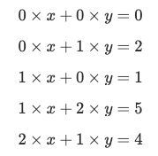

Reed-Solomon编码允许任意信息用冗余内容进行扩展，这样的加长信息经过有噪声地传输后，只要出错数量少于事先定义的值，就能被完美地纠错解码。这使RS编码在有噪声的媒介上（比如电波，电话线路，磁盘，闪存等）可以保持信息的完整性，即所有的被传输信息在接收后都可以正确重建，即使是接收过来的是有一些错误的。

Reed-Solomon编码允许任意信息用冗余内容进行扩展，这样的加长信息经过有噪声地传输后，只要出错数量少于事先定义的值，就能被完美地纠错解码。这使RS编码在有噪声的媒介上（比如电波，电话线路，磁盘，闪存等）可以保持信息的完整性，即所有的被传输信息在接收后都可以正确重建，即使是接收过来的是有一些错误的。

上面通过简单相加的过程实现了最简单的数据冗余，但怎么实现更强的容错呢？我们可以设定不一样的系数。比如令 x = 1, y = 2，那么可以通过构造不同的系数得到不同的冗余数据，下面随便举几个例子。

当 x 丢失的时候，我们可以发现公式 1、2 无法为重构 x 提供帮助的，因为其系数为 0，冗余的值与 x 线性无关。

所以，正常情况下，我们需要尽可能地保证方程要包含所有数据块的信息。

RS 的冗余计算方式是将文件切成 K 个数据块（data shards），假设 N 个数据块排成一列，通过对数据从开头到结尾进行多项式计算来生成 M 个校验块（parity shards），这样得到的校验块就包含了 N 个数据块的信息。

