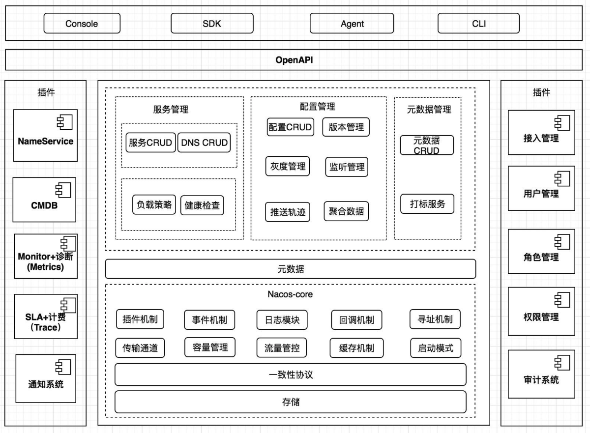

1. 易⽤：简单的数据模型，标准的 restfulAPI，易用的控制台，丰富的使用文档。稳定：99.9% 高可用，脱胎于历经阿里巴巴 10 年生产验证的内部产品，支持具有数百万服务的大规模场景，具备企业级 SLA 的开源产品。
2. 实时：数据变更毫秒级推送生效；1w 级，SLA 承诺 1w 实例上下线 1s，99.9%推送完成；10w级，SLA 承诺 1w 实例上下线 3s，99.9% 推送完成；100w 级别，SLA 承诺1w实例上下线9s99.9% 推送完成。
3. 规模：十万级服务/配置，百万级连接，具备强大扩展性。

#### 架构图
整体架构分为用户层、业务层、内核层和插件，用户层主要解决用户使用的易用性问题，业务层主要解决服务发现和配置管理的功能问题，内核层解决分布式系统⼀致性、存储、高可用等核心问题，插件解决扩展性问题。

#### 用户层
- OpenAPI：暴露标准 Rest 风格 HTTP 接口，简单易用，方便多语言集成。
- Console：易用控制台，做服务管理、配置管理等操作。
- SDK：多语言 SDK，目前几乎支持所有主流编程语言。
- Agent：Sidecar模式运行，通过标准 DNS 协议与业务解耦。
- CLI：命令行对产品进行轻量化管理，像 git 

#### 业务层
- 服务管理：实现服务 CRUD，域名 CRUD，服务健康状态检查，服务权重管理等功能。
- 配置管理：实现配置管 CRUD，版本管理，灰度管理，监听管理，推送轨迹，聚合数据等功能。
- 元数据管理：提供元数据 CURD 和打标能力，为实现上层流量和服务灰度非常关键。

#### 内核层
- 插件机制：实现三个模块可分可合能力，实现扩展点 SPI 机制，用于扩展自己公司定制。
- 事件机制：实现异步化事件通知，SDK 数据变化异步通知等逻辑，是Nacos 高性能的关键部分。
- 日志模块：管理日志分类，日志级别，日志可移植性（尤其避免冲突），日志格式，异常码+帮助文档。
- 回调机制：SDK 通知数据，通过统⼀的模式回调用户处理。接口和数据结构需要具备可扩展性。
- 寻址模式：解决 Server IP 直连，域名访问，Nameserver 寻址、广播等多种寻址模式，需要可扩展。
- 推送通道：解决 Server 与存储、Server 间、Server 与 SDK 间高效通信问题。
- 容量管理：管理每个租户，分组下的容量，防止存储被写爆，影响服务可用性。
- 流量管理：按照租户，分组等多个维度对请求频率，长链接个数，报文大小，请求流控进行控制。
- 缓存机制：容灾目录，本地缓存，Server 缓存机制，是 Nacos 高可用的关键。
- 启动模式：按照单机模式，配置模式，服务模式，DNS 模式模式，启动不同的模块。
- ⼀致性协议：解决不同数据，不同⼀致性要求情况下，不同⼀致性要求，是Nacos 做到AP协议的关键。
- 存储模块：解决数据持久化、非持久化存储，解决数据分片问题。

#### 插件
- Nameserver：解决 Namespace 到 ClusterID 的路由问题，解决用户环境与Nacos 物理环境映射问题。
- CMDB：解决元数据存储，与三方 CMDB 系统对接问题，解决应用，人，资源关系。
- Metrics：暴露标准 Metrics 数据，方便与三方监控系统打通。
- Trace：暴露标准 Trace，方便与 SLA 系统打通，日志白平化，推送轨迹等能力，并且可以和计量计费系统打通。
- 接入管理：相当于阿里云开通服务，分配身份、容量、权限过程。
- 用户管理：解决用户管理，登录，SSO 等问题。
- 权限管理：解决身份识别，访问控制，角色管理等问题。
- 审计系统：扩展接口方便与不同公司审计系统打通。
- 通知系统：核心数据变更，或者操作，方便通过 SMS 系统打通，通知到对应人数据变更

#### 为什么 Nacos 选择了 Raft 以及 Distro

服务之间感知对方是依靠服务注册与发现机制，因此对服务注册与发现的可用性要求就比较高，另外，Nacos 的服务注册发现设计，采取了心跳可自动完成服务数据补偿的机制，如果数据丢失的话，很快就可以补充。

上述的都是针对于 Nacos 服务发现注册中的非持久化服务而言（即需要客户端上报心跳进行服务实例续约）。而对于 Nacos 服务发现注册中的持久化服务，因为所有的数据都是直接使用调用Nacos服务端直接创建，因此需要由 Nacos 保障数据在各个节点之间的强⼀致性，故而针对此类型的服务数据，选择了强⼀致性共识算法来保障数据的⼀致性。

#### Distro 协议

Distro 协议是 Nacos 社区自研的⼀种 AP 分布式协议，是面向临时实例设计的⼀种分布式协议，
其保证了在某些 Nacos 节点宕机后，整个临时实例处理系统依旧可以正常工作。作为⼀种有状态
的中间件应用的内嵌协议，Distro 保证了各个 Nacos 节点对于海量注册请求的统⼀协调和存储。

**设计思想**

- Nacos 每个节点是平等的都可以处理写请求，同时把新数据同步到其他节点。
- 每个节点只负责部分数据，定时发送自己负责数据的校验值到其他节点来保持数据⼀致性。
- 每个节点独立处理读请求，及时从本地发出响应。

在 Distro 协议的设计思想下，每个 Distro 节点都可以接收到读写请求。所有的 Distro 协议的请
求场景主要分为三种情况：
1. 当该节点接收到属于该节点负责的实例的写请求时，直接写入。
2. 当该节点接收到不属于该节点负责的实例的写请求时，将在集群内部路由，转发给对应的节点，
从而完成读写。
1. 当该节点接收到任何读请求时，都直接在本机查询并返回（因为所有实例都被同步到了每台机
器上）。

Nacos2.0 能够较无压力的支撑 10w 级的客户端和 50w 级的服务实例，在模拟实际场景上有较
大的优化，特别是针对 dubbo 的接口级服务发现的单客户端注册多服务的场景，有更大的优化
幅度，符合预期；