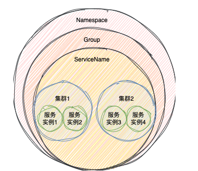

##### 临时实例与永久实例
ephemeral=true 临时实例，等于false永久实例

1. 临时实例保存在注册表里（concurrentHashMap）, 永久实例不仅会保存在注册表，也会保存在数据（derby或mysql）；
2. 临时实例比较适合业务服务，永久实例比较适合mysql,redis；

nacos 1.x 中，服务有临时实例也有永久实例；在2.x中，服务要么是临时实例，要么是永久实例；


#### 节点的通信方式

1. 1.x 使用http; 2.x使用gRPC,长链接的方式

当注册临时实例时，nacos2.x还会在客户端存储服务信息到缓存中，在服务注册或订阅时，网络发生故障，通过redo操作实现补偿操作。（redo是一个定时任务，默认3秒执行一次）

#### 高可用

##### 心跳机制

心跳机制只针对临时实例,它的作用是服务实例告诉注册中心我还活着。

正常情况下，服务下线会向注册中心发送下线请求，nacos收到后，会把服务从注册表删除。如果出现网络故障，服务端无法知道服务是否正常使用。

nacos 1.x, 通过定时器实现心跳，HTTP的方式

- 客户端的定时器(上报)
1. 默认5秒钟的时间间隔，客户端主动告知服务端健康状态；
2. 服务端15秒未收到心跳并没超过30秒时，将实例设置为不健康状态；
3. 超过30秒，服务端删除注册实例。

- 服务端的定时器（检查）：
1. 默认间隔20秒，查询服务实例的健康状态；
2. 健康状态检查失败后，把服务实例标注为不健康，不会删除
3. 另外如果检查到服务实例的注册信息不存在，也会重新注册（类redo）


nacos 2.x，GRPC的方式

- 连接断开,就把服务实例从注册表删除

- 服务端的定时器（检查）：
1. 默认间隔20秒，查询服务实例的健康状态；
2. 健康状态检查失败后，把服务实例标注为不健康，不会删除

持久化实例健康检查失败后会被标记成不健康，而临时实例会直接从列表中被删除


##### 健康检查

永久实例通过健康检查的机制判断服务实例是否存活

nacos 服务端创建一个定时任务，每个2-7秒检查服务实例, 执行方式：
1. tcp ip和端口
2. http 发送请求，请求服务端需要自己实现
3. mysql(show global variables where variable_name = "read_only")
默认是tcp方式

#### 服务发现

nacos提供两种方式
1. 主动查询  客户端主动查询服务实例信息(pull模式)
2. 服务订阅  客户端向nacos发送订阅请求，当被订阅的服务有信息变化就会把服务信息推送给客户端（PUSH模式）

默认使用订阅模式

nacos 1.x和2.x都是通过namaservice#subscribe发起订阅，通过eventlistener,拿到最新的服务实例。但在处理方式上有差异

- nacos 1.x

1. 客户端启动时，创建PushReceiver类，创建udp socket 接收服务端的推送信息
2. 客户端调用NameService#subscribe发起订阅，先去服务端查询所有服务实例信息，并保存在本地缓存中。并发udp socket端口发给服务端，服务端通过这个端口推送服务实例信息
3. 为订阅开启一个不定时任务（最长60s,正常10s,服务端返回），补偿UDP不稳定导致的订阅失败

- nacos 2.x

1. 推送换成GPPC的方式，但服务实例有变化时，直接通过这个长连接推送
2. 依然有不定时任务，默认关闭，因为回复连接后，有redo的操作，还是会拿到最新的服务信息

1.x 任何服务都可以被订阅，2.x只支持订阅临时实例。

#### 数据一致性

nacos 支持AP和CP, 通常临时实例优先保证可用(ap)，永久实例优先保证数据一致性（cp）


##### NACOS的AP

使用阿里的distro协议

1. 每个节点都可以进行读写操作
2. 当某个节点加入时，想其他节点发起请求，获取服务实例信息
3. 当某个节点接收服务注册时，不仅会把信息保存在自身的服务注册表中，同时也会发送给其他所有服务节点
4. 每个节点只负责部分数据，定时发送负责数据的校验值到其他节点保持数据的一致性
5. 当某个节点故障时，整体集群还是可用

保证最终一致性的机制
1. 失败重试机制  数据同步给其他节点失败时，会间隔3s重试，知道成功
2. 定时对比机制(心跳)  每个服务节点会向其他节点发送认证请求，通过自己负责的版本号实例，对数据进行对比，如果其他节点的版本号比自己的小，那就发送数据更新其他节点的数据

##### NACOS的CP

使用raft协议


#### nacos ap/cp模式

Nacos 集群默认支持的是CAP原则中的AP原则，但是也可切换为CP原则，切换命令如下：

```
curl -X PUT '$NACOS_SERVER:8848/nacos/v1/ns/operator/switches?entry=serverMode&value=CP'
```

同时微服务的bootstrap.properties 需配置如下选项指明注册为临时/永久实例
AP模式不支持数据一致性，所以只支持服务注册的临时实例，CP模式支持服务注册的永久实例，满足配置文件的一致性

```
#false为永久实例，true表示临时实例开启，注册为临时实例
spring.cloud.nacos.discovery.ephemeral=false
```

#### 数据模型

nacos 的服务由三部分组成
1. 命名空间(namespace)： 多租户隔离，默认是public
2. 分组（group）: 环境隔离
3. 服务名 : 

 

在服务注册的时候，可以指定这个服务实例在哪个集体的集群中，默认是在DEFAULT集群下