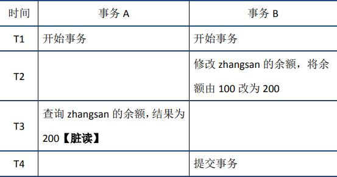
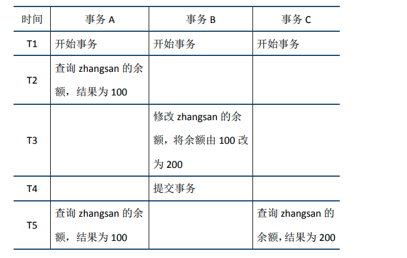
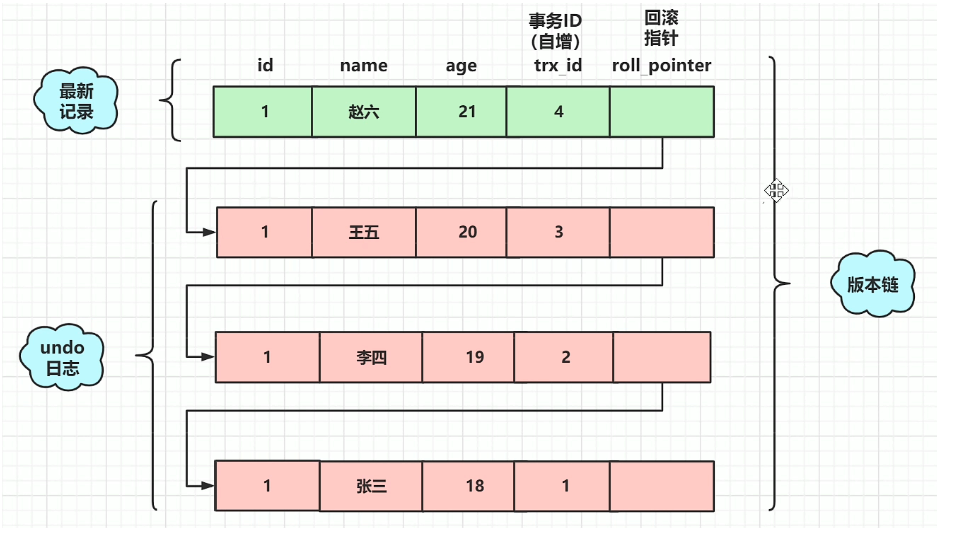
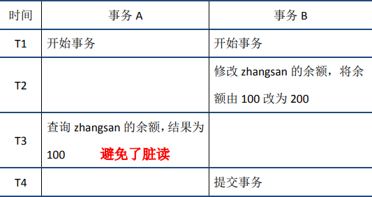
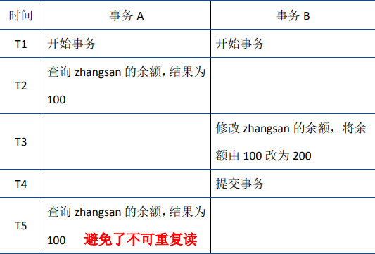
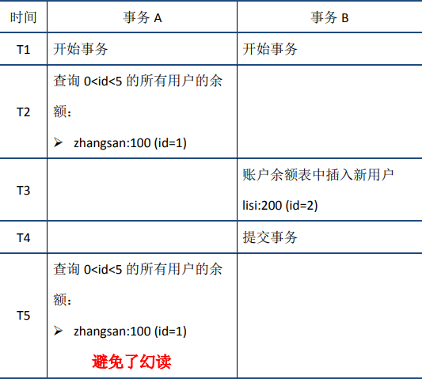
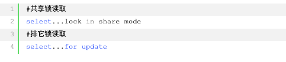
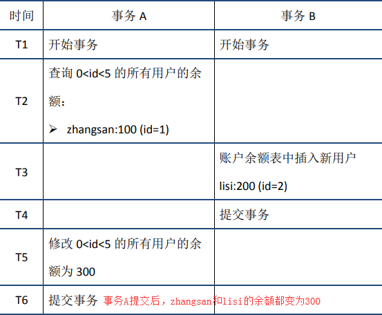

#### ACID属性

ACID是衡量事务的四个特性：

- 原子性（Atomicity），可以理解为一个事务内的所有操作要么都执行，要么都不执行。
- 一致性（Consistency），可以理解为数据是满足完整性约束的，也就是不会存在中间状态的数据，比如你账上有400，我账上有100，你给我打200块，此时你账上的钱应该是200，我账上的钱应该是300，不会存在我账上钱加了，你账上钱没扣的中间状态。
- 隔离性（Isolation），指的是多个事务并发执行的时候不会互相干扰，即一个事务内部的数据对于其他事务来说是隔离的。
- 持久性（Durability），指的是一个事务完成了之后数据就被永远保存下来，之后的其他操作或故障都不会对事务的结果产生影响。

#### 原子性

##### 定义
原子性是指一个事务是一个不可分割的工作单位，其中的操作要么都做，要么都不做；如果事务中一个sql语句执行失败，则已执行的语句也必须回滚，数据库退回到事务前的状态.
##### 原理
MySQL的日志有很多种，如二进制日志、错误日志、查询日志、慢查询日志等，此外InnoDB存储引擎还提供了两种事务日志：redo log(重做日志)和undo log(回滚日志)。其中redo log用于保证事务持久性；undo log则是事务原子性和隔离性实现的基础。

实现原子性的关键，是当事务回滚时能够撤销所有已经成功执行的sql语句。InnoDB实现回滚，靠的是undo log：当事务对数据库进行修改时，InnoDB会生成对应的undo log；如果事务执行失败或调用了rollback，导致事务需要回滚，便可以利用undo log中的信息将数据回滚到修改之前的样子。

undo log属于逻辑日志，它记录的是sql执行相关的信息。当发生回滚时，InnoDB会根据undo log的内容做与之前相反的工作：对于每个insert，回滚时会执行delete；对于每个delete，回滚时会执行insert；对于每个update，回滚时会执行一个相反的update，把数据改回去。

以update操作为例：当事务执行update时，其生成的undo log中会包含被修改行的主键(以便知道修改了哪些行)、修改了哪些列、这些列在修改前后的值等信息，回滚时便可以使用这些信息将数据还原到update之前的状态。

#### 一致性
##### 定义
持久性是指事务一旦提交，它对数据库的改变就应该是永久性的。接下来的其他操作或故障不应该对其有任何影响。

##### 原理
redo log和undo log都属于InnoDB的事务日志。下面先聊一下redo log存在的背景。

InnoDB作为MySQL的存储引擎，数据是存放在磁盘中的，但如果每次读写数据都需要磁盘IO，效率会很低。为此，InnoDB提供了缓存(Buffer Pool)，Buffer Pool中包含了磁盘中部分数据页的映射，作为访问数据库的缓冲：当从数据库读取数据时，会首先从Buffer Pool中读取，如果Buffer Pool中没有，则从磁盘读取后放入Buffer Pool；当向数据库写入数据时，会首先写入Buffer Pool，Buffer Pool中修改的数据会定期刷新到磁盘中（这一过程称为刷脏）。

Buffer Pool的使用大大提高了读写数据的效率，但是也带了新的问题：如果MySQL宕机，而此时Buffer Pool中修改的数据还没有刷新到磁盘，就会导致数据的丢失，事务的持久性无法保证。

于是，redo log被引入来解决这个问题：当数据修改时，除了修改Buffer Pool中的数据，还会在redo log记录这次操作；当事务提交时，会调用fsync接口对redo log进行刷盘。如果MySQL宕机，重启时可以读取redo log中的数据，对数据库进行恢复。redo log采用的是WAL（Write-ahead logging，预写式日志），所有修改先写入日志，再更新到Buffer Pool，保证了数据不会因MySQL宕机而丢失，从而满足了持久性要求。

既然redo log也需要在事务提交时将日志写入磁盘，为什么它比直接将Buffer Pool中修改的数据写入磁盘(即刷脏)要快呢？主要有以下两方面的原因：

1. 刷脏是随机IO，因为每次修改的数据位置随机，但写redo log是追加操作，属于顺序IO。

2. 刷脏是以数据页（Page）为单位的，MySQL默认页大小是16KB，一个Page上一个小修改都要整页写入；而redo log中只包含真正需要写入的部分，无效IO大大减少。

###### redo log与binlog
我们知道，在MySQL中还存在binlog(二进制日志)也可以记录写操作并用于数据的恢复，但二者是有着根本的不同的：

（1）作用不同：redo log是用于crash recovery的，保证MySQL宕机也不会影响持久性；binlog是用于point-in-time recovery的，保证服务器可以基于时间点恢复数据，此外binlog还用于主从复制。

（2）层次不同：redo log是InnoDB存储引擎实现的，而binlog是MySQL的服务器层(可以参考文章前面对MySQL逻辑架构的介绍)实现的，同时支持InnoDB和其他存储引擎。

（3）内容不同：redo log是物理日志，内容基于磁盘的Page；binlog的内容是二进制的，根据binlog_format参数的不同，可能基于sql语句、基于数据本身或者二者的混合。

（4）写入时机不同：binlog在事务提交时写入；redo log的写入时机相对多元：

前面曾提到：当事务提交时会调用fsync对redo log进行刷盘；这是默认情况下的策略，修改innodb_flush_log_at_trx_commit参数可以改变该策略，但事务的持久性将无法保证。
除了事务提交时，还有其他刷盘时机：如master thread每秒刷盘一次redo log等，这样的好处是不一定要等到commit时刷盘，commit速度大大加快。

##### 隔离性
与原子性、持久性侧重于研究事务本身不同，隔离性研究的是不同事务之间的相互影响。隔离性是指，事务内部的操作与其他事务是隔离的，并发执行的各个事务之间不能互相干扰。严格的隔离性，对应了事务隔离级别中的Serializable (可串行化)，但实际应用中出于性能方面的考虑很少会使用可串行化。

隔离性追求的是并发情形下事务之间互不干扰。简单起见，我们主要考虑最简单的读操作和写操作(加锁读等特殊读操作会特殊说明)，那么隔离性的探讨，主要可以分为两个方面：

(一个事务)写操作对(另一个事务)写操作的影响：锁机制保证隔离性
(一个事务)写操作对(另一个事务)读操作的影响：MVCC保证隔离性

##### 锁机制
首先来看两个事务的写操作之间的相互影响。隔离性要求同一时刻只能有一个事务对数据进行写操作，InnoDB通过锁机制来保证这一点。

锁机制的基本原理可以概括为：事务在修改数据之前，需要先获得相应的锁；获得锁之后，事务便可以修改数据；该事务操作期间，这部分数据是锁定的，其他事务如果需要修改数据，需要等待当前事务提交或回滚后释放锁。

行锁与表锁

按照粒度，锁可以分为表锁、行锁以及其他位于二者之间的锁。表锁在操作数据时会锁定整张表，并发性能较差；行锁则只锁定需要操作的数据，并发性能好。但是由于加锁本身需要消耗资源(获得锁、检查锁、释放锁等都需要消耗资源)，因此在锁定数据较多情况下使用表锁可以节省大量资源。MySQL中不同的存储引擎支持的锁是不一样的，例如MyIsam只支持表锁，而InnoDB同时支持表锁和行锁，且出于性能考虑，绝大多数情况下使用的都是行锁。

#### 脏读
A事务读取了B事务尚未提交的更改数据，并在这个数据上的基础上进行操作。如果恰好B事务进行回滚，那么A事务读到的数据数据根本是不被承认的。

#### 不可重复读
A事务读取B事务已提交的更改数据。

#### 幻象读
A事务读取B事务提交的新增数据(在事务A中按照某个条件先后两次查询数据库，两次查询结果的条数不同)

脏读与不可重复读的区别在于：前者读到的是其他事务未提交的数据，后者读到的是其他事务已提交的数据
不可重复读与幻读的区别可以通俗的理解为：前者是数据变了，后者是数据的行数变了

#### 事务的隔离级别

|隔离级别 | 脏读 | 不可重复读 | 幻读 |
| ---- | ---- | ----- | ----- |
| Read Uncommitted (RU读未提交)   |  允许     |  允许     |   允许    |
| Read Committed (RC 读已提交)     |  不允许    |   允许    |    允许   |
| Repeatable Read (RR 可重复读)     |  不允许    |   不允许    |    允许  |
| Serializable (可串行化)     |  不允许    |   不允许    |   不允许    |

**InnoDB默认的隔离级别是RR**，在SQL标准中，RR是无法避免幻读问题的；但是InnoDB实现的RR，在只读事务中可以避免幻读问题。

#### MVCC(Multi-Version Concurrency Control): 多版本的并发控制协议
RR解决脏读、不可重复读、幻读等问题，使用的是MVCC。下面的例子很好的体现了MVCC的特点：在同一时刻，不同的事务读取到的数据可能是不同的(即多版本)——在T5时刻，事务A和事务C可以读取到不同版本的数据。

MVCC最大的优点是读不加锁，因此读写不冲突，并发性能好。InnoDB实现MVCC，多个版本的数据可以共存，主要基于以下技术及数据结构：

1. 隐藏列：InnoDB中每行数据都有隐藏列，隐藏列中包含了本行数据的事务id、指向undo log的指针等。
2. 基于undo log的版本链：前面说到每行数据的隐藏列中包含了指向undo log的指针，而每条undo log也会指向更早版本的undo log，从而形成一条版本链。
3. ReadView：通过隐藏列和版本链，MySQL可以将数据恢复到指定版本；但是具体要恢复到哪个版本，则需要根据ReadView来确定。所谓ReadView，是指事务（记做事务A）在某一时刻给整个事务系统（trx_sys）打快照，之后再进行读操作时，会将读取到的数据中的事务id与trx_sys快照比较，从而判断数据对该ReadView是否可见，即对事务A是否可见。

trx_sys中的主要内容，以及判断可见性的方法如下：

low_limit_id：表示生成ReadView时系统中应该分配给下一个事务的id。如果数据的事务id大于等于low_limit_id，则对该ReadView不可见。
up_limit_id：表示生成ReadView时当前系统中活跃的读写事务中最小的事务id。如果数据的事务id小于up_limit_id，则对该ReadView可见。
rw_trx_ids：表示生成ReadView时当前系统中活跃的读写事务的事务id列表。如果数据的事务id在low_limit_id和up_limit_id之间，则需要判断事务id是否在rw_trx_ids中：如果在，说明生成ReadView时事务仍在活跃中，因此数据对ReadView不可见；如果不在，说明生成ReadView时事务已经提交了，因此数据对ReadView可见。

下面以RR隔离级别为例，结合前文提到的几个问题分别说明。
1. 脏读

当事务A在T3时刻读取zhangsan的余额前，会生成ReadView，由于此时事务B没有提交仍然活跃，因此其事务id一定在ReadView的rw_trx_ids中，因此根据前面介绍的规则，事务B的修改对ReadView不可见。接下来，事务A根据指针指向的undo log查询上一版本的数据，得到zhangsan的余额为100。这样事务A就避免了脏读。

2. 不可重复读

当事务A在T2时刻读取zhangsan的余额前，会生成ReadView。此时事务B分两种情况讨论，一种是如图中所示，事务已经开始但没有提交，此时其事务id在ReadView的rw_trx_ids中；一种是事务B还没有开始，此时其事务id大于等于ReadView的low_limit_id。无论是哪种情况，根据前面介绍的规则，事务B的修改对ReadView都不可见。

当事务A在T5时刻再次读取zhangsan的余额时，会根据T2时刻生成的ReadView对数据的可见性进行判断，从而判断出事务B的修改不可见；因此事务A根据指针指向的undo log查询上一版本的数据，得到zhangsan的余额为100，从而避免了不可重复读。

3. 幻读

MVCC避免幻读的机制与避免不可重复读非常类似。

当事务A在T2时刻读取0<id<5的用户余额前，会生成ReadView。此时事务B分两种情况讨论，一种是如图中所示，事务已经开始但没有提交，此时其事务id在ReadView的rw_trx_ids中；一种是事务B还没有开始，此时其事务id大于等于ReadView的low_limit_id。无论是哪种情况，根据前面介绍的规则，事务B的修改对ReadView都不可见。

当事务A在T5时刻再次读取0<id<5的用户余额时，会根据T2时刻生成的ReadView对数据的可见性进行判断，从而判断出事务B的修改不可见。因此对于新插入的数据lisi(id=2)，事务A根据其指针指向的undo log查询上一版本的数据，发现该数据并不存在，从而避免了幻读。

#### 扩展
前面介绍的MVCC，是RR隔离级别下“非加锁读”实现隔离性的方式。下面是一些简单的扩展。

（1）读已提交（RC）隔离级别下的非加锁读

RC与RR一样，都使用了MVCC，其主要区别在于：

RR是在事务开始后第一次执行select前创建ReadView，直到事务提交都不会再创建。根据前面的介绍，RR可以避免脏读、不可重复读和幻读。

RC每次执行select前都会重新建立一个新的ReadView，因此如果事务A第一次select之后，事务B对数据进行了修改并提交，那么事务A第二次select时会重新建立新的ReadView，因此事务B的修改对事务A是可见的。因此RC隔离级别可以避免脏读，但是无法避免不可重复读和幻读。

（2）加锁读与next-key lock

按照是否加锁，MySQL的读可以分为两种：

一种是非加锁读，也称作快照读、一致性读，使用普通的select语句，这种情况下使用MVCC避免了脏读、不可重复读、幻读，保证了隔离性。

另一种是加锁读，查询语句有所不同，如下所示：

#共享锁读取
select...lock in share mode
#排它锁读取
select...for update
加锁读在查询时会对查询的数据加锁（共享锁或排它锁）。由于锁的特性，当某事务对数据进行加锁读后，其他事务无法对数据进行写操作，因此可以避免脏读和不可重复读。而避免幻读，则需要通过next-key lock。next-key lock是行锁的一种，实现相当于record lock(记录锁) + gap lock(间隙锁)；其特点是不仅会锁住记录本身(record lock的功能)，还会锁定一个范围(gap lock的功能)。因此，加锁读同样可以避免脏读、不可重复读和幻读，保证隔离性。

#### 总结
概括来说，InnoDB实现的RR，通过锁机制（包含next-key lock）、MVCC（包括数据的隐藏列、基于undo log的版本链、ReadView）等，实现了一定程度的隔离性，可以满足大多数场景的需要。

不过需要说明的是，RR虽然在只读事务中避免了幻读问题，但是毕竟不是Serializable，不能保证完全的隔离，下面是两个例子：

第一个例子，如果在事务中第一次读取采用非加锁读，第二次读取采用加锁读，则如果在两次读取之间数据发生了变化，两次读取到的结果不一样，因为加锁读时不会采用MVCC。

第二个例子，如下所示。

#### 一致性

##### 定义
一致性是指事务执行结束后，数据库的完整性约束没有被破坏，事务执行的前后都是合法的数据状态。数据库的完整性约束包括但不限于：实体完整性（如行的主键存在且唯一）、列完整性（如字段的类型、大小、长度要符合要求）、外键约束、用户自定义完整性（如转账前后，两个账户余额的和应该不变）。

##### 实现
可以说，一致性是事务追求的最终目标：前面提到的原子性、持久性和隔离性，都是为了保证数据库状态的一致性。此外，除了数据库层面的保障，一致性的实现也需要应用层面进行保障。

实现一致性的措施包括：
- 保证原子性、持久性和隔离性，如果这些特性无法保证，事务的一致性也无法保证
- 数据库本身提供保障，例如不允许向整形列插入字符串值、字符串长度不能超过列的限制等
- 应用层面进行保障，例如如果转账操作只扣除转账者的余额，而没有增加接收者的余额，无论数据库实现的多么完美，也无法保证状态的一致

下面总结一下ACID特性及其实现原理：
- 原子性：语句要么全执行，要么全不执行，是事务最核心的特性，事务本身就是以原子性来定义的；实现主要基于undo log
- 持久性：保证事务提交后不会因为宕机等原因导致数据丢失；实现主要基于redo log
- 隔离性：保证事务执行尽可能不受其他事务影响；InnoDB默认的隔离级别是RR，RR的实现主要基于锁机制（包含next-key lock）、MVCC（包括数据的隐藏列、基于undo log的版本链、ReadView）
- 一致性：事务追求的最终目标，一致性的实现既需要数据库层面的保障，也需要应用层面的保障

参考资料:
https://www.cnblogs.com/kismetv/p/10331633.html