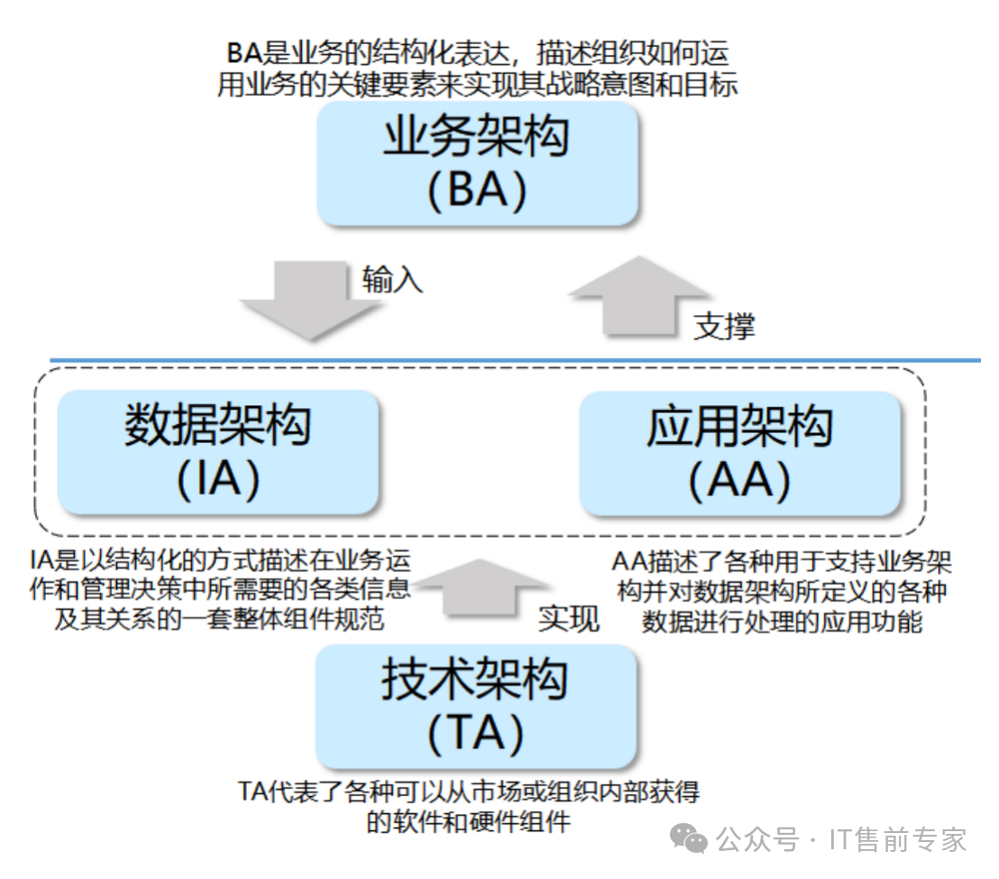
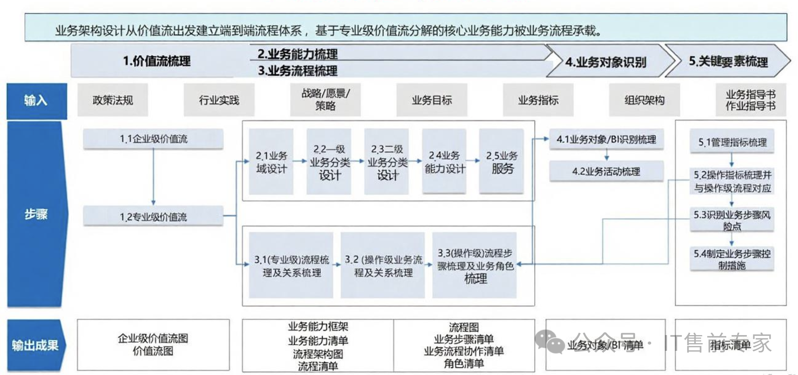
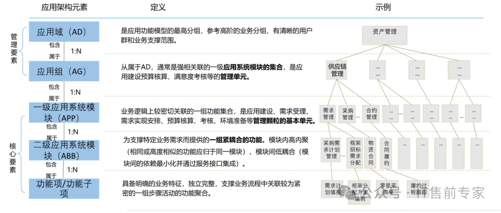
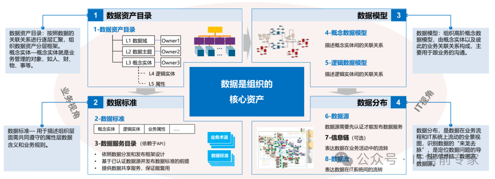
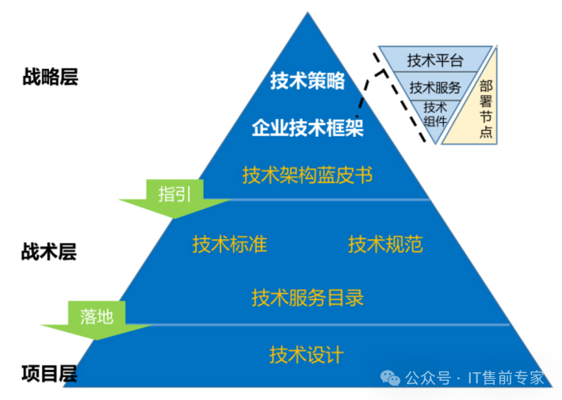
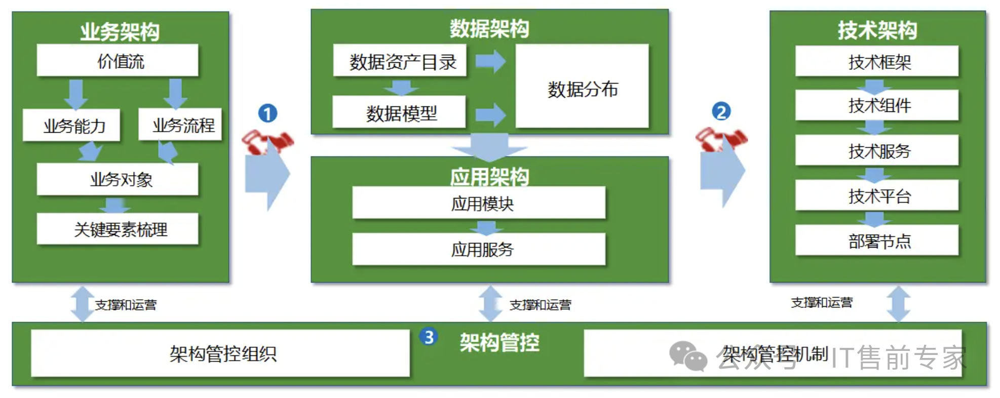

#### 什么是4A架构

企业架构（Enterprise Architecture，简称EA）是一种综合性的企业架构模型，主要包括四个核心要素:**业务架构、数据架构、应用架和技术架构**。这种架构模型旨在帮助企业更好地理解和管理其业务、数据、应用和技术方面的复杂性，从而提高整体运营效率和竞争力。

4A架构不是技术堆砌，而是一套从战略到落地的系统性方法论，帮助企业打通业务、数据、应用与技术之间的壁垒，实现真正的协同进化。

4A架构由四个相互关联、层层递进的层面构成：
- 业务架构（Business Architecture）：转型的起点，定义“我们做什么”。
- 应用架构（Application Architecture）：实现的载体，规划“用什么系统做”。
- 数据架构（Data Architecture）：转型的核心，解决“数据如何流转与利用”。
- 技术架构（Technology Architecture）：基础支撑，保障“底层环境是否可靠”。

四者协同，共同构成企业数字化转型的“顶层设计”，确保战略能真正落地，系统能持续演进。

#### 一、业务架构：一切转型的起点

业务架构是连接企业战略与执行的桥梁。它回答的是最根本的问题：**我们的业务模式是什么？为客户创造什么价值？关键流程有哪些？**

一个清晰的业务架构包含：
- 业务能力模型：将企业能力分层拆解（如人力资源、财务、营销等），细化到具体活动与任务，形成可量化的业务能力图谱。
- 组织与治理：明确各部门职责、汇报关系与决策机制，确保组织能支撑业务运转。
- 核心业务流程：梳理端到端的业务流，识别关键节点与瓶颈，为后续系统建设提供输入。
- ✅ 关键作用：业务架构是其他所有架构的前提。没有清晰的业务蓝图，技术投入就容易偏离方向，陷入“为数字化而数字化”的误区。

#### 二、应用架构：系统的“设计蓝图”

应用架构是业务能力的“翻译官”，它定义了**哪些系统需要建设、系统之间如何协作**，确保软件体系能有效支撑业务运转。
核心内容包括：
- 应用系统清单：如ERP、OA、HR、CRM、MES、电商平台等。
- 系统功能边界：明确每个系统的职责，避免重复建设或功能真空。
- 系统间交互关系：通过接口、消息队列等方式实现数据与流程的打通。
- ✅ 关键作用：避免“信息孤岛”。一个良好的应用架构能实现跨部门、跨系统的高效协同，提升整体运营效率。

#### 三、数据架构：数字化的核心资产

在数据驱动的时代，**数据就是新的石油**。数据架构定义了企业数据的“生产、存储、管理与使用”规则。
它关注：
- 数据模型：统一客户、产品、订单等核心数据的定义，确保“一个数据一个口径”。
- 数据存储与分布：数据放在哪里？是集中式数据湖，还是分布式数据库？
- 数据治理：建立数据质量、安全与生命周期管理机制，保障数据可信可用。
- 数据服务化：将数据封装为API，供业务系统调用，实现数据驱动决策。
✅ 关键作用：数据架构是实现精准营销、智能分析、AI决策的基础。没有它，大数据和人工智能都无从谈起。

#### 四、技术架构：坚实的底层支撑

技术架构是整个数字化体系的“地基”，它定义了支撑业务、数据和应用运行的软硬件环境。
主要包括：
- IT基础设施：服务器、存储、网络等物理资源。
- 云计算平台：公有云、私有云或混合云架构的选择与部署。
- 中间件与开发框架：如微服务架构、容器化（Docker/K8s）、API网关等。
- 安全与合规：网络安全、数据加密、访问控制等保障措施。
- ✅ 关键作用：确保系统高可用、可扩展、安全可靠。技术架构的先进性，直接决定了企业应对业务变化的敏捷能力。

#### 4A架构如何协同工作

想象你要建造一栋大楼：
- 业务架构是建筑的“功能需求”——要建写字楼还是商场？有多少楼层？
- 应用架构是“建筑结构图”——承重墙、楼梯、电梯的位置。
- 数据架构是“水电管网系统”——水、电、网络如何布线？
- 技术架构是“地基与建材”——用钢筋混凝土还是木结构？地基打多深？四者缺一不可，必须同步规划、协同演进。
  

#### 从“能用”到“好用”，再到“智能”
数字化转型不是一蹴而就的项目，而是一场持续的进化。4A架构为企业提供了一张清晰的“导航图”，帮助组织从混乱走向有序，从局部优化走向全局协同。

无论你是企业高管、业务负责人，还是IT从业者，理解4A架构，就是掌握数字化时代的核心思维。

真正的数字化，不是上了多少系统，而是是否构建了一个可生长、可进化的企业能力体系。如果你的企业正在或即将启动数字化转型，不妨从梳理4A架构开始，为未来打下坚实基础。