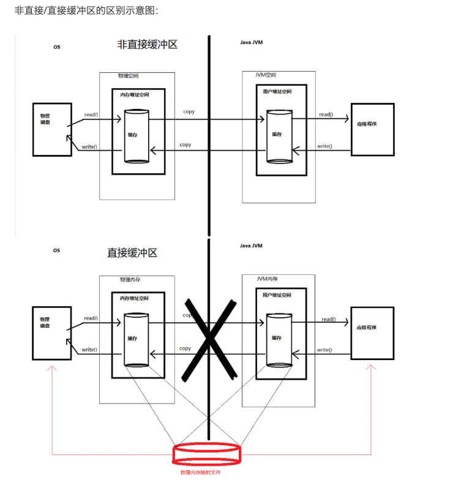

#### Java的网络IO模型
1. BIO (Blocking I/O)：阻塞式 I/O，即在 I/O 操作时，线程会被阻塞，等待 I/O 操作完成。
2. NIO (New I/O)：非阻塞式 I/O，即在 I/O 操作时，线程不会被阻塞，而是通过轮询的方式来检查 I/O 操作是否完成。
3. AIO (Asynchronous I/O)：异步 I/O，即在 I/O 操作时，线程不会被阻塞，而是通过回调的方式来处理 I/O 操作结果。
   
NIO的优点缺点
1. NIO 的主要优点是性能高，因为 NIO 使用了多路复用技术，可以同时处理多个 I/O 操作。
2. NIO 的主要缺点是复杂，需要掌握 NIO 的 API。
3. NIO 的主要应用场景是网络编程，如 HTTP 服务器、FTP 服务器、数据库连接、文件传输等。

NIO的使用场景有哪些？
1. 网络编程：NIO 可以实现非阻塞式 I/O，从而提高网络编程的性能。
2. 文件处理：NIO 可以实现文件处理，如文件复制、文件移动、文件删除等。
3. 数据库连接：NIO 可以实现数据库连接，如数据库查询、数据库更新等。
4. 文件传输：NIO 可以实现文件传输，如 FTP 服务器、文件上传、文件下载等。
5. 聊天室：NIO 可以实现聊天室，如聊天室聊天、聊天室广播等。
   

BIO: 同步并阻塞(传统阻塞型)，服务器实现模式为一个连接一个线程，即客户端有连接请求时服务器端就需要启动一个线程进行处理，如果这个连接不做任何事情会造成不必要的线程开销
NIO: 同步非阻塞(新式非阻塞型)， 服务器实现模式为一个线程处理多个请求(连接)，即客户端发送的连接请求都会注册到多路复用器上，多路复用器轮询到连接有 I/O 请求就进行处理.
AIO:异步非阻塞，服务器实现模式为一个有效请求一个线程，客户端的I/O请求都是由OS先完成了再通知服务器应用去启动线程进行处理，一般适用于连接数较多且连接时间较长的应用

- BIO方式适用于连接数目比较小且固定的架构，这种方式对服务器资源要求比较高，并发局限于应用中，JDK1.4以前的唯一选择，但程序简单易理解。

- NIO 方式适用于连接数目多且连接比较短（轻操作）的架构，比如聊天服务器，弹幕系统，服务器间通讯等，JDK1.4 开始支持。

- AIO 方式使用于连接数目多且连接比较长（重操作）的架构，比如相册服务器，充分调用 OS 参与并发操作，编程比较复杂，JDK7 开始支持。


#### Java AIO

与NIO不同，当进行读写操作时，只须直接调用API的read或write方法即可, 这两种方法均为异步的，对于读操作而言，当有流可读取时，操作系统会将可读的流传入read方法的缓冲区,对于写操作而言，当操作系统将write方法传递的流写入完毕时，操作系统主动通知应用程序即可以理解为，read/write方法都是异步的，完成后会主动调用回调函数。在JDK1.7中，这部分内容被称作NIO.2，主要在Java.nio.channels包下增加了下面四个异步通道：

AsynchronousSocketChannel

AsynchronousServerSocketChannel

AsynchronousFileChannel

AsynchronousDatagramChannel


#### Java NIO 的定义

Java NIO (New IO) 是 Java 1.4 引入的，用于处理 I/O 操作。它是feild-oriented 的，即基于缓冲区，而非基于流，提供非阻塞的 I/O 操作。

#### 为什么使用Java NIO
1. 线程模型：Java NIO 允许多个线程同时处理多个通道，因此可以提高并发性能。
2. 零拷贝：Java NIO 可以零拷贝，即数据直接从源通道到目标通道，从而提高性能。
3. 缓冲区：Java NIO 使用缓冲区来处理数据，因此可以提高性能。
4. 非阻塞I/O：Java NIO 非阻塞 I/O 可以提高性能，因为可以同时处理多个通道。
5. 兼容性：Java NIO 兼容 Java IO，因此可以与 Java IO 一起使用。

#### Java NIO 的基本概念
java NIO 的核心类有：
1. Channel：通道，用于从源通道读取数据，并写入目标通道。
2. Buffer：缓冲区，用于存储数据。
3. Selector：选择器，用于监听通道的就绪状态。
4. FileChannel：文件通道，用于从文件中读取数据，并写入文件。
5. SocketChannel：套接字通道，用于从套接字读取数据，并写入套接字。
6. ServerSocketChannel：服务器套接字通道，用于监听套接字的连接请求。
7. DatagramChannel：数据报通道，用于从数据报套接字读取数据，并写入数据报套接字。
8. Selector：选择器，用于监听多个通道的就绪状态。
9.  FileLock：文件锁，用于锁定文件，防止其他进程访问。

#### 什么是Channel
Channel 是 Java NIO 中的一个抽象类，它提供了一种 uniform 的方式来访问不同的 I/O 设备，如文件、套接字、管道等。Channel 的主要作用是提供一种非阻塞的 I/O 模型，使得程序可以在 I/O 操作完成时收到通知，从而避免了 I/O 阻塞。


##### Channel 子类
1.  FileChannel：用于文件操作，如读、写、映射等。
2.  SocketChannel：用于TCP网络操作，如读、写等。
3.  ServerSocketChannel：用于服务器端监听，如接收客户端连接。
4.  DatagramChannel：用于 UDP 通信，如读、写等。

Channel并不存储数据，只负责数据的传输。

用java编写一个filechanel的读写操作的例子：
```
public class FileChannelDemo { 
    public static void main(String[] args) throws IOException {
        FileChannel channel = new RandomAccessFile("file.txt", "rw").getChannel();
        ByteBuffer buffer = ByteBuffer.allocate(1024);
        while (channel.read(buffer) != -1) {
            buffer.flip();  //把position设为0，limit设为实际读取的字节数
            while (buffer.hasRemaining()) {
                System.out.print((char) buffer.get());
                buffer.clear();
                channel.close();
                System.out.println();
                System.out.println("文件读取完毕");
            }
        }
    }
    //filechannel的写操作
    public static void write(FileChannel channel) throws IOException { 
        ByteBuffer buffer = ByteBuffer.allocate(1024);
        buffer.put("hello world".getBytes());
        buffer.flip();
        while (buffer.hasRemaining()) {
            channel.write(buffer);
            System.out.println("write");
            Thread.sleep(1000);
            buffer.clear();
            System.out.println("clear");
        }
    }
}
```
用javava语言写一个SocketChannel的例子
```
public class SocketChannelDemo { 
    public static void main(String[] args) throws IOException, InterruptedException { 
        SocketChannel channel = SocketChannel.open();
        channel.connect(new InetSocketAddress("127.0.0.1", 8080));
        ByteBuffer buffer = ByteBuffer.allocate(1024);
        while (channel.read(buffer) != -1) {
            buffer.flip();
            System.out.println(new String(buffer.array()));
            buffer.clear();
            Thread.sleep(1000);
            channel.write(ByteBuffer.wrap("Hello World".getBytes()));
            channel.write(ByteBuffer.wrap("How are you?".getBytes()));
            Thread.sleep(1000);
            channel.write(ByteBuffer.wrap("I'm fine, thank you.".getBytes()));
            Thread.sleep(1000);
            channel.write(ByteBuffer.wrap("Bye.".getBytes()));
            Thread.sleep(1000);
            channel.write(ByteBuffer.wrap("Goodbye.".getBytes()));
            channel.close();
            System.out.println("Message sent.");
            while (channel.read(buffer) > 0) {
                buffer.flip();
                System.out.println(new String(buffer.array()));
                buffer.clear();
                Thread.sleep(1000);
                channel.write(ByteBuffer.wrap("How are you?".getBytes()));
                System.out.println("Message sent.");
                Thread.sleep(1000);
                channel.write(ByteBuffer.wrap("I'm fine.".getBytes()));
                System.out.println("Message sent.");
                Thread.sleep(1000);
                channel.write(ByteBuffer.wrap("Bye.".getBytes()));
                System.out.println("Message sent.");
                Thread.sleep(1000);
                channel.close();
            }
        }
    }
}
```

用Java创建ServerSocketChannel的例子
```
public class Server { 
    public static void main(String[] args) throws IOException { 
        ServerSocketChannel server = ServerSocketChannel.open();
        server.socket().bind(new InetSocketAddress(8080));
        while (true) {
            SocketChannel channel = server.accept();
            while (channel.read(buffer) != -1) {
                buffer.flip();
                while (buffer.hasRemaining()) {
                    System.out.print((char) buffer.get());
                    buffer.clear();
                    channel.write(buffer);
                    channel.close();
                    buffer.clear();
                    server.close();
                }
            }
        }
    }
}
```
#### 什么是Buffer
Buffer 是 Netty 中的一个核心类，用于存储和操作数据。Buffer 的作用是把数据写入到 Channel 中，或者从 Channel 中读取数据。Buffer 提供了丰富的方法，用于操作数据，如 put()、get()、flip()、clear() 等。

Buffer是一个内存块,有Java堆的buffer和直接内存的buffer。
1. Java堆的buffer：ByteBuffer.allocate(1024);
2. 直接内存的buffer：ByteBuffer.allocateDirect(1024);

直接内存的buffer使用场景：
1. 适用于大文件传输
2. 适用于频繁的IO操作

java代码创建bytebuffer的例子：
```
public class Test {
    public static void main(String[] args) {
        ByteBuffer buffer = ByteBuffer.allocate(1024);
        System.out.println("初始化：" + buffer);
        System.out.println("capacity:" + buffer.capacity());
        System.out.println("limit:" + buffer.limit());
        System.out.println("position:" + buffer.position());
        buffer.put("hello".getBytes());
        System.out.println("写入：" + buffer);
        System.out.println("capacity:" + buffer.capacity());
        System.out.println("limit:" + buffer.limit());
        System.out.println("position:" + buffer.position());
        buffer.flip();
        System.out.println("翻转：" + buffer);
        System.out.println("capacity:" + buffer.capacity());
        System.out.println("limit:" + buffer.limit());
        System.out.println("position:" + buffer.position());
        byte[] dst = new byte[buffer.limit()];
        buffer.get(dst);
        System.out.println("读取：" + new String(dst));
        System.out.println("capacity:" + buffer.capacity());
        System.out.println("limit:" + buffer.limit());
        System.out.println("position:" + buffer.position());
        buffer.clear();
        System.out.println("清空：" + buffer);
        System.out.println("capacity:" + buffer.capacity());
        System.out.println("limit:" + buffer.limit());
        System.out.println("position:" + buffer.position());
    }
}
```
#### 什么是selector
selector可以理解为多路复用器，selector可以同时监听多个通道(事件驱动)，当某个通道有数据可读时，selector会返回该通道，然后通过该通道获取数据。

selector的核心API:
1. selector.open(): 打开一个selector
2. selector.select(): 监听通道，返回监听到的通道数量
3. selector.selectedKeys(): 返回监听到的通道


#### Channel间的数据传输
1. transferTo: 将数据从Channel写入到FileChannel
2. transferFrom: 将数据从FileChannel写入到Channel

##### 分散读取和聚合写入
1. 分散读取：将Channel的数据写入多个buffer中,ScatteringByteChannel
2. 聚合写入：将多个buffer的数据写入Channel,GatheringByteChannel

使用场景就是可以使用一个缓冲区数组，自动地根据需要去分配缓冲区的大小。可以减少内存消耗,网络IO也可以使用.

用Java编写一个分散读取的例子
```
public class ScatterRead { 
     //获取文件输入流
        File file = new File("1.txt");
        FileInputStream inputStream = new FileInputStream(file);
        //从文件输入流获取通道
        FileChannel inputStreamChannel = inputStream.getChannel();
        //获取文件输出流
        FileOutputStream outputStream = new FileOutputStream(new File("2.txt"));
        //从文件输出流获取通道
        FileChannel outputStreamChannel = outputStream.getChannel();
        //创建三个缓冲区，分别都是5
        ByteBuffer byteBuffer1 = ByteBuffer.allocate(5);
        ByteBuffer byteBuffer2 = ByteBuffer.allocate(5);
        ByteBuffer byteBuffer3 = ByteBuffer.allocate(5);
        //创建一个缓冲区数组
        ByteBuffer[] buffers = new ByteBuffer[]{byteBuffer1, byteBuffer2, byteBuffer3};
        //循环写入到buffers缓冲区数组中，分散读取
        long read;
        long sumLength = 0;
        while ((read = inputStreamChannel.read(buffers)) != -1) {
            sumLength += read;
            Arrays.stream(buffers)
                    .map(buffer -> "posstion=" + buffer.position() + ",limit=" + buffer.limit())
                    .forEach(System.out::println);
            //切换模式
            Arrays.stream(buffers).forEach(Buffer::flip);
            //聚合写入到文件输出通道
            outputStreamChannel.write(buffers);
            //清空缓冲区
            Arrays.stream(buffers).forEach(Buffer::clear);
        }
        System.out.println("总长度:" + sumLength);
        //关闭通道
        outputStream.close();
        inputStream.close();
        outputStreamChannel.close();
        inputStreamChannel.close();
}
```

#### 直接缓冲区和堆缓冲区

从示意图中我们可以发现，最大的不同在于直接缓冲区不需要再把文件内容copy到物理内存中。这就大大地提高了性能。
100M的文件直接缓冲区比堆缓冲区快差不多1倍

#### 网络IO
NIO的主要用途是网络IO,在NIO之前Java使用Socket类进行网络IO，但是Socket类有缺陷，比如：Socket类不能处理大文件传输，而且Socket类不能处理多个客户端同时连接,是阻塞的。

主要思想是把Channel通道注册到Selector中，通过Selector去监听Channel中的事件状态，这样就不需要阻塞等待客户端的连接，从主动等待客户端的连接，变成了通过事件驱动。没有监听的事件，服务器可以做自己的事情。

用java编写使用selector的例子,包括服务端和客户端。
```
public class NIOServer {
    public static void main(String[] args) throws Exception {
        //打开一个ServerSocketChannel
        ServerSocketChannel serverSocketChannel = ServerSocketChannel.open();
        InetSocketAddress address = new InetSocketAddress("127.0.0.1", 6666);
        //绑定地址
        serverSocketChannel.bind(address);
        //设置为非阻塞
        serverSocketChannel.configureBlocking(false);
        //打开一个选择器
        Selector selector = Selector.open();
        //serverSocketChannel注册到选择器中,监听连接事件
        serverSocketChannel.register(selector, SelectionKey.OP_ACCEPT);
        //循环等待客户端的连接
        while (true) {
            //等待3秒，（返回0相当于没有事件）如果没有事件，则跳过
            if (selector.select(3000) == 0) {
                System.out.println("服务器等待3秒，没有连接");
                continue;
            }
            //如果有事件selector.select(3000)>0的情况,获取事件
            Set<SelectionKey> selectionKeys = selector.selectedKeys();
            //获取迭代器遍历
            Iterator<SelectionKey> it = selectionKeys.iterator();
            while (it.hasNext()) {
                //获取到事件
                SelectionKey selectionKey = it.next();
                //判断如果是连接事件
                if (selectionKey.isAcceptable()) {
                    //服务器与客户端建立连接，获取socketChannel
                    SocketChannel socketChannel = serverSocketChannel.accept();
                    //设置成非阻塞
                    socketChannel.configureBlocking(false);
                    //把socketChannel注册到selector中，监听读事件，并绑定一个缓冲区
                    socketChannel.register(selector, SelectionKey.OP_READ, ByteBuffer.allocate(1024));
                }
                //如果是读事件
                if (selectionKey.isReadable()) {
                    //获取通道
                    SocketChannel socketChannel = (SocketChannel) selectionKey.channel();
                    //获取关联的ByteBuffer
                    ByteBuffer buffer = (ByteBuffer) selectionKey.attachment();
                    //打印从客户端获取到的数据
                    socketChannel.read(buffer);
                    System.out.println("from 客户端：" + new String(buffer.array()));
                }
                //从事件集合中删除已处理的事件，防止重复处理
                it.remove();
            }
        }
    }
}
```
```
public class NIOClient {
    public static void main(String[] args) throws Exception {
        SocketChannel socketChannel = SocketChannel.open();
        InetSocketAddress address = new InetSocketAddress("127.0.0.1", 6666);
        socketChannel.configureBlocking(false);
        //连接服务器
        boolean connect = socketChannel.connect(address);
        //判断是否连接成功
        if(!connect){
            //等待连接的过程中
            while (!socketChannel.finishConnect()){
                System.out.println("连接服务器需要时间，期间可以做其他事情...");
            }
        }
        String msg = "hello java技术爱好者！";
        ByteBuffer byteBuffer = ByteBuffer.wrap(msg.getBytes());
        //把byteBuffer数据写入到通道中
        socketChannel.write(byteBuffer);
        //让程序卡在这个位置，不关闭连接
        System.in.read();
    }
}
```

#### SelectionKey

在SelectionKey类中有四个常量表示四种事件，来看源码：
```
public abstract class SelectionKey {
    //读事件
    public static final int OP_READ = 1 << 0; //2^0=1
    //写事件
    public static final int OP_WRITE = 1 << 2; // 2^2=4
    //连接操作,Client端支持的一种操作
    public static final int OP_CONNECT = 1 << 3; // 2^3=8
    //连接可接受操作,仅ServerSocketChannel支持
    public static final int OP_ACCEPT = 1 << 4; // 2^4=16
}
```

参考资料