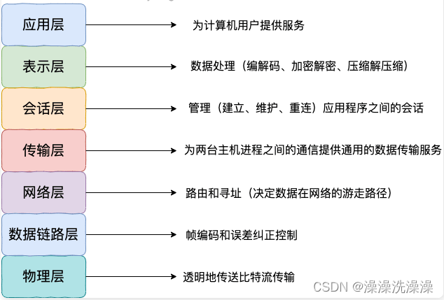
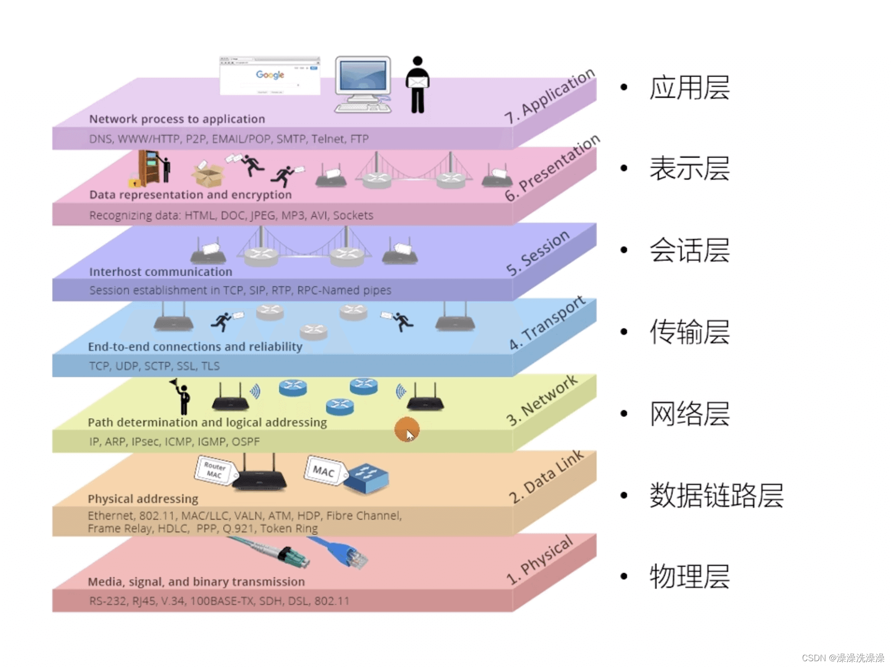
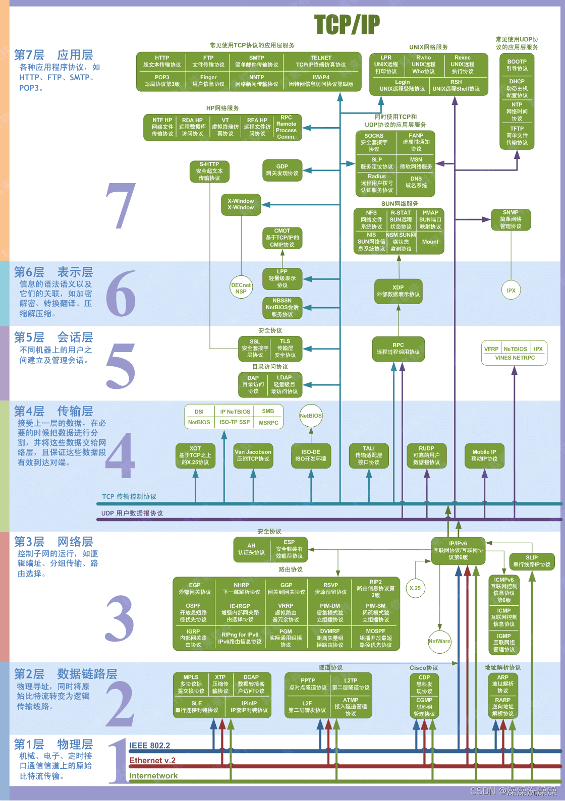
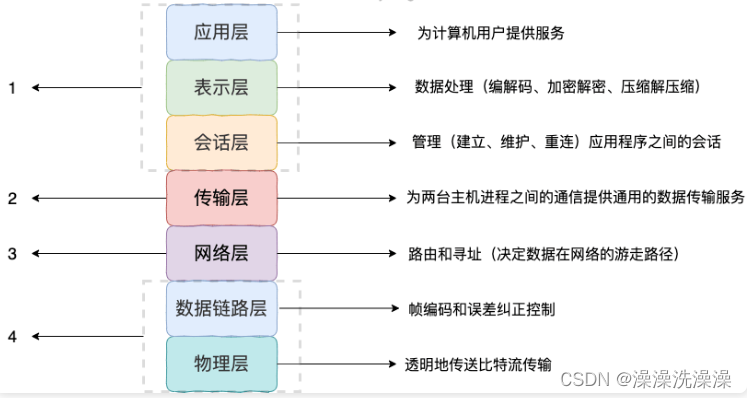
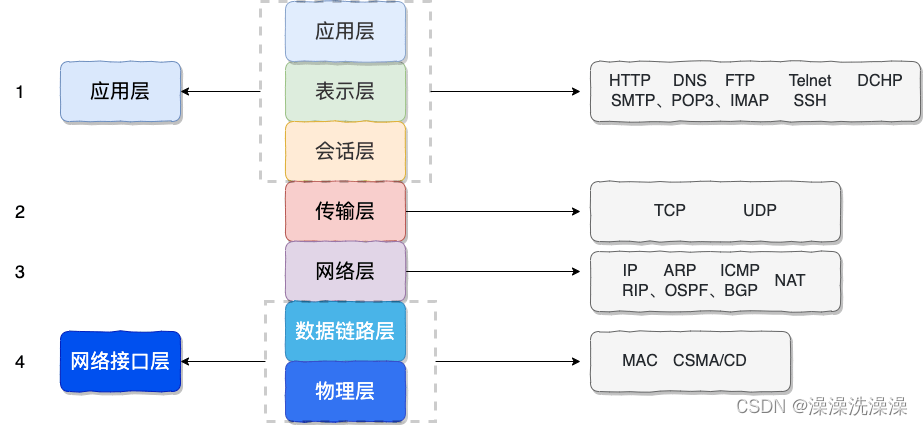

#### 七层网络模型

#### TCP/IP 四层模型

#### ##应用层常见协议

HTTP（HyperText Transfer Protocol）：用于在客户端和服务器之间传输超文本数据，通常用于 Web 浏览器和 Web 服务器之间的通信。

FTP（File Transfer Protocol）：用于在客户端和服务器之间传输文件，支持上传和下载文件的功能。

SMTP（Simple Mail Transfer Protocol）：用于在邮件服务器之间传输电子邮件，负责发送邮件。

POP3（Post Office Protocol version 3）：用于从邮件服务器上下载邮件到本地计算机，负责接收邮件。

IMAP（Internet Message Access Protocol）：也是用于接收邮件的协议，与 POP3 类似，但提供了更丰富的功能，如在服务器上管理邮件等。

DNS（Domain Name System）：用于将域名解析为对应的 IP 地址，从而实现域名和 IP 地址之间的映射。

HTTPS（HyperText Transfer Protocol Secure）：是 HTTP 的安全版本，通过 SSL/TLS 加密传输数据，保证通信过程中的安全性。

SSH（Secure Shell）：用于远程登录和执行命令，提供了加密的网络连接，保证了通信的安全性。

SNMP（Simple Network Management Protocol）：用于网络设备之间的管理和监控，可以实现对网络设备的远程配置和监控。

Telnet：用于远程登录和执行命令，类似于 SSH，但不提供加密功能，通信数据不安全。

#### 传输层常见协议

TCP（Transmission Control Protocol）：提供可靠的、面向连接的数据传输服务，确保数据的可靠性、顺序性和完整性。TCP适用于对数据传输质量要求较高的场景，如文件传输、网页浏览等。

UDP（User Datagram Protocol）：提供无连接的数据传输服务，不保证数据的可靠性，也不保证数据的顺序性和完整性。UDP适用于实时性要求较高、对数据传输质量要求不那么严格的场景，如音视频传输、在线游戏等。

#### 网络层常见协议

IP（Internet Protocol）：是互联网中最基本的协议，用于在网络中传输数据包。IP协议定义了数据包的格式、寻址方式和路由选择等信息，是整个互联网的基础。

ICMP（Internet Control Message Protocol）：用于在IP网络中传递控制消息和错误信息。ICMP通常用于网络设备之间的通信，如路由器和主机之间的通信，以及用于检测网络连通性和故障诊断。

ARP（Address Resolution Protocol）：用于将IP地址映射为MAC地址（物理地址）。ARP协议在局域网内部使用，通过发送ARP请求获取目标设备的MAC地址，从而实现数据包的传输。

RARP（Reverse Address Resolution Protocol）：与ARP相反，用于将MAC地址映射为IP地址。RARP协议通常用于无盘工作站等设备，可以根据MAC地址获取对应的IP地址。

IPv6（Internet Protocol version 6）：是IP协议的下一代版本，用于解决IPv4地址空间不足的问题。IPv6采用128位地址长度，提供了更大的地址空间，支持更多的设备连接到互联网。

